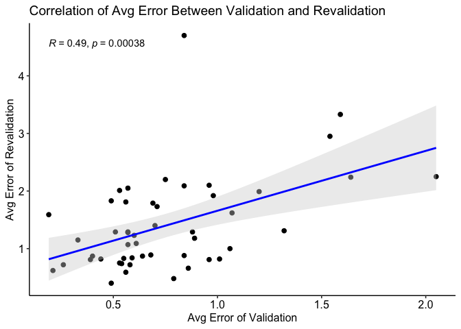
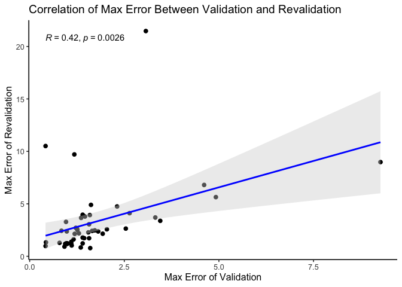
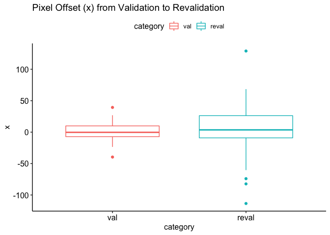
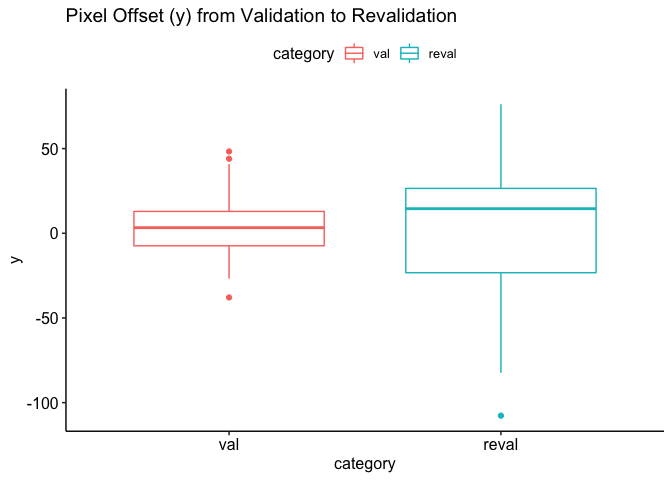
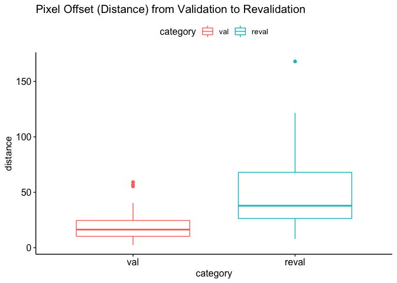
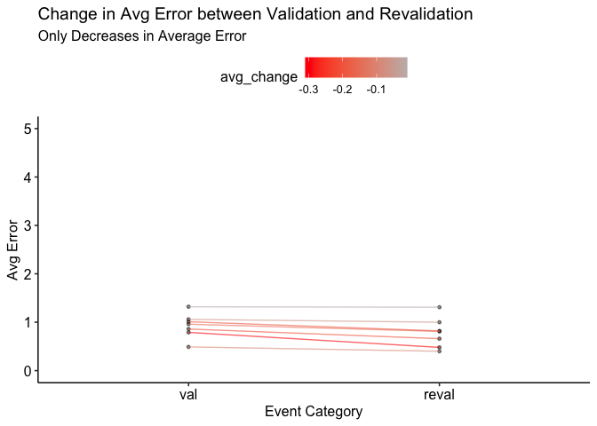
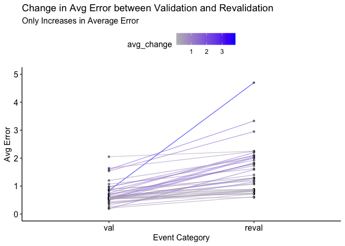
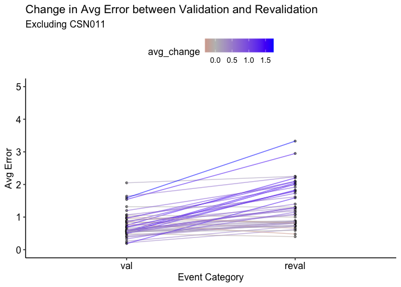

Eyetracker Data Preprocessing
=============================

Setup
-----

### Libraries

``` r
library(tidyverse)
library(ggpubr)
```

### Formatting

``` r
make_pretty_df <- function(df) {
  if (isTRUE(getOption('knitr.in.progress'))) {
    knitr::kable(df, "simple", format.args = list(big.mark = ",", scientific = FALSE))
  } else {
    df
  }
}
```

File path definitions
---------------------

``` r
root_path <- "/Volumes/shlab/Projects/CSN"
extracted_data_path <- "/data/extracted/eyetracker"
event_csv <- "fevent.csv"
sample_csv <- "fsample.csv"
ioevent_csv <- "ioevent.csv"
recordings_csv <- "recordings.csv"

id_prefix <- "CSN"
id_length <- 3
min_id <- 1
max_id <- 57
```

Loading methods
---------------

``` r
get_path_to_id <- function(id) {
  padded_id <- stringr::str_pad(id, 3, pad = "0")
  participant_id <- stringr::str_c(id_prefix, padded_id)
  return (
    file.path(
      root_path, 
      extracted_data_path, 
      participant_id
    )
  )
}

get_id_vector <- function() {
  # Gets a vector of id integers for participants relative
  # to the existence of that participant's data (some participants
  # are not converted from raw MAT data to CSVs if not considered
  # a complete participant)
  id_vector <- c()
  for (i in min_id:max_id) {
    if ( dir.exists(get_path_to_id(i)) ) {
      id_vector <- c(id_vector, i)
    }
  }
  return (id_vector)
}

load_all_etd_by_filename_csv <-function(id_vector, filename_csv = sample_csv) {
  # Loads all eyetracking data of given filename across participants
  etd_list <- list()
  for (id in id_vector) {
    path_to_etd <- file.path(get_path_to_id(id), filename_csv)
    etd_list[[id]] <- readr::read_csv(path_to_etd)
  }
  return (etd_list)
}

# Convenience instantiation of the id vector for later use. Can use
# the getter method at any point for same output.
id_vector <- get_id_vector()
```

Load each data for all participants
-----------------------------------

``` r
etd_events <- load_all_etd_by_filename_csv(id_vector, event_csv)
etd_ioevents <- load_all_etd_by_filename_csv(id_vector, ioevent_csv)
etd_recordings <- load_all_etd_by_filename_csv(id_vector, recordings_csv)
# TAKES A LOT OF TIME TO LOAD. UNCOMMENT IF WANTED.
#etd_samples <- load_all_etd_by_filename_csv(id_vector, sample_csv)
```

### Events data methods using `edt_events` list

``` r
CALIBRATION_RESULT_MESSAGE <- "!CAL CALIBRATION HV9 R RIGHT"
VALIDATION_RESULT_MESSAGE <- "!CAL VALIDATION HV9 R RIGHT"
CATEGORY_STRING_PATTERN <- "CALIBRATION|VALIDATION"
QUALITY_STRING_PATTERN <- "GOOD|FAIR|POOR"
AVG_ERROR_STRING_INDEX <- 8
MAX_ERROR_STRING_INDEX <- 10
DEG_OFFSET_STRING_INDEX <- 13
PIX_OFFSET_STRING_INDEX <- 15


get_category_from_message <- function(message) {
  # Extract the category of event message
  as.character(str_extract(message, CATEGORY_STRING_PATTERN))
}


get_quality_from_message <- function(message) {
  # Extract the quality of calibration or validation from event message
  as.character(str_extract(message, QUALITY_STRING_PATTERN))
}


get_avg_error_from_message <- function(message) {
  # Extract the avg error of validation
  as.double(word(message, AVG_ERROR_STRING_INDEX))
}


get_max_error_from_message <- function(message) {
  # Extract the max error of validation
  as.double(word(message, MAX_ERROR_STRING_INDEX))
}


get_deg_offset_from_message <- function(message) {
  # Extract the deg offset of validation
  as.double(word(message, DEG_OFFSET_STRING_INDEX))
}


get_pix_offset_from_message <- function(message) {
  # Extract the x coordinate of pix offset of validation
  word(message, PIX_OFFSET_STRING_INDEX)
}


get_event_messages <- function(participant_events) {
  # Get the significant event messages for a single participant
  # events data by sttime, producing the extracted rows and columns 
  # from message contents.
  
  if ("df" %in% ls()) rm("df")
  
  # Select desired columns and remove white space around message
  df <- participant_events %>%
    select(message, sttime) %>%
    transmute(message = str_squish(str_trim(message)), sttime = sttime) 
  
  # Extract rows from categorized event result messages
  df <- df %>%
    filter(str_detect(message, CALIBRATION_RESULT_MESSAGE) | str_detect(message, VALIDATION_RESULT_MESSAGE)) %>%
    mutate(
      category = get_category_from_message(message),
      quality = get_quality_from_message(message),
      avg_error = get_avg_error_from_message(message),
      max_error = get_max_error_from_message(message),
      deg_offset = get_deg_offset_from_message(message),
      pix_offset = get_pix_offset_from_message(message)
    ) 
  
  # Extract columns for pixel offsets of x,y coordinates
  df <- df %>%
    separate(pix_offset, c("pix_x_offset", "pix_y_offset"), ",") %>%
    mutate(
      pix_x_offset = as.double(pix_x_offset),
      pix_y_offset = as.double(pix_y_offset)
    ) 
  
  # Move message column to last column for convenient notebook 
  # reading of dataframe output
  df <- df %>%
    relocate(-message)
  
  return (df)
  
}
```

``` r
# Output a single participant's important calibration/validation info
make_pretty_df(
  get_event_messages(etd_events[[5]])
)
```

|     sttime| category    | quality |  avg\_error|  max\_error|  deg\_offset|  pix\_x\_offset|  pix\_y\_offset| message                                                                                    |
|----------:|:------------|:--------|-----------:|-----------:|------------:|---------------:|---------------:|:-------------------------------------------------------------------------------------------|
|  2,475,622| CALIBRATION | GOOD    |          NA|          NA|           NA|              NA|              NA| !CAL CALIBRATION HV9 R RIGHT GOOD                                                          |
|  2,499,059| VALIDATION  | GOOD    |        0.44|        1.11|         0.11|            -4.4|            -1.9| !CAL VALIDATION HV9 R RIGHT GOOD ERROR 0.44 avg. 1.11 max OFFSET 0.11 deg. -4.4,-1.9 pix.  |
|  6,231,071| VALIDATION  | GOOD    |        0.85|        1.13|         0.70|            -3.6|            32.7| !CAL VALIDATION HV9 R RIGHT GOOD ERROR 0.85 avg. 1.13 max OFFSET 0.70 deg. -3.6,32.7 pix.  |
|  6,269,103| VALIDATION  | GOOD    |        0.82|        1.03|         0.64|           -20.0|            21.0| !CAL VALIDATION HV9 R RIGHT GOOD ERROR 0.82 avg. 1.03 max OFFSET 0.64 deg. -20.0,21.0 pix. |

### Recordings data methods using `etd_recordings` list

``` r
get_duration <- function(id) {
  # Duration from highest start time and lowest start time, in minutes
  summary <- etd_recordings[[id]] %>% 
    summarize(duration = (max(time) - min(time)) / (1000*60) ) %>%
    unnest(cols = c())
  return(summary$duration)
}

get_durations <- function(id_vector) {
  # Durations in minutes for all participants events' data
  durations <- c()
  for (i in id_vector) {
    durations <- c(durations, get_duration(i))
  }
  return(durations)
}

get_recording_time_matrix <- function(id_vector, dimensional_reducer = 1) {
  # Get a built matrix with a row for each id in id_vector, with four
  # times per row. Optional dimensional reducer to achieve times in seconds, minutes.
  n_ids <- length(id_vector)
  n_recordings <- 1 + length(etd_recordings[[id_vector[[1]]]]$time)
  recording_time_matrix <- matrix(NA, nrow=n_ids, ncol=n_recordings)
  
  for (i in 1:n_ids) {
    id <- id_vector[i]
    recording_time_matrix[i,] <- c(id, (etd_recordings[[id]]$time / dimensional_reducer))
  }
  
  return(recording_time_matrix)
  
}

get_recording_time_df <- function(id_vector, dimensional_reducer = 1) {
  # Get dataframe using matrix of ids and times from recordings. Optional
  # dimensional reducer to achieve times in seconds, minutes.
  m <- get_recording_time_matrix(id_vector, dimensional_reducer)
  df <- as.data.frame(m)
  recording_time_df_cols <- c("id", "calibration", "validation", "task", "revalidation")
  colnames(df) <- recording_time_df_cols
  
  return(df)
  
}
```

### Look at recording times

Can retrieve all recording moments across participants by seconds or
minutes. In seconds, the difference between revalidation and task time,
then subtracting 3600, provides an idea of how much “overtime” the task
went.

``` r
recording_time_df_seconds <- get_recording_time_df(id_vector, 1000)
recording_time_df_minutes <- get_recording_time_df(id_vector, 1000 * 60)

sort(recording_time_df_seconds$revalidation - recording_time_df_seconds$task - 3600)
```

    ##  [1]  25.149  28.309  31.267  31.483  31.733  32.517  32.635  33.821  34.419
    ## [10]  38.285  39.071  39.623  40.975  44.711  44.805  45.775  45.877  46.277
    ## [19]  47.045  48.175  49.093  49.677  50.481  52.581  53.299  55.383  56.825
    ## [28]  59.169  63.325  64.039  72.231  73.695  74.839  79.483  79.915  80.015
    ## [37]  84.351  95.241  99.463 113.003 115.135 116.207 135.669 139.489 145.689
    ## [46] 155.581 212.885 240.137 263.149

Joint data methods
------------------

``` r
get_val_reval_by_id <- function(recording_time_df, i) {
  
  recording_times_for_id <- recording_time_df %>%
    filter(id == i)
  
  all_validations_by_id <- get_event_messages(etd_events[[i]]) %>%
    filter(category == "VALIDATION") %>%
    select(-c(message, category))

  validation <- all_validations_by_id %>%
    filter(sttime < recording_times_for_id$task) %>%
    arrange(sttime) %>%
    slice_tail(n = 1) %>%
    mutate(id = as.integer(i)) %>%
    relocate(id) %>%
    rename_with(~ paste(.x, "val", sep = "_"), -id)
    
  revalidation <- all_validations_by_id %>%
    filter(sttime > (recording_times_for_id$task + 60 * 60 * 1000)) %>%
    arrange(sttime) %>%
    slice_tail(n = 1) %>%
    mutate(id = as.integer(i)) %>%
    relocate(id) %>%
    rename_with(~ paste(.x, "reval", sep = "_"), -id)
  
  left_join(
    validation,
    revalidation,
    by = c("id")
  )
  
}


get_all_val_reval_df <- function(id_vector) {
  
  if ("df" %in% ls()) rm("df")
  
  df <- data.frame()
  
  recording_time_df <- get_recording_time_df(id_vector)
  
  for (i in id_vector) {
    val_reval_df <- get_val_reval_by_id(recording_time_df, i)
    df <- bind_rows(df, val_reval_df)
  }
  
  return(df)
}

get_recording_and_val_reval_df <- function(recording_time_df, all_val_reval_df) {
  
  left_join(
    recording_time_df, 
    all_val_reval_df,
    by = c("id")
  )
  
}
```

### Combine recording times with significant event details per participant

``` r
recording_time_df <- get_recording_time_df(id_vector)
all_val_reval_df <- get_all_val_reval_df(id_vector)

recording_and_val_reval_df <- get_recording_and_val_reval_df(recording_time_df, all_val_reval_df)
```

Visulaize the head of the dataframe:

``` r
make_pretty_df(
  head(recording_and_val_reval_df, 10)
)
```

|   id|  calibration|  validation|        task|  revalidation|  sttime\_val| quality\_val |  avg\_error\_val|  max\_error\_val|  deg\_offset\_val|  pix\_x\_offset\_val|  pix\_y\_offset\_val|  sttime\_reval| quality\_reval |  avg\_error\_reval|  max\_error\_reval|  deg\_offset\_reval|  pix\_x\_offset\_reval|  pix\_y\_offset\_reval|
|----:|------------:|-----------:|-----------:|-------------:|------------:|:-------------|----------------:|----------------:|-----------------:|--------------------:|--------------------:|--------------:|:---------------|------------------:|------------------:|-------------------:|----------------------:|----------------------:|
|    1|      881,864|     881,939|   1,335,826|     5,081,515|    1,195,390| POOR         |             2.05|             9.27|              1.46|                 39.3|                 40.9|      5,115,802| POOR           |               2.25|               8.98|                1.44|                   55.1|                   30.7|
|    2|    1,330,220|   1,330,285|   2,036,216|     5,899,365|    1,909,910| POOR         |             1.54|             3.32|              0.56|                -16.7|                -16.3|      5,928,119| POOR           |               2.95|               3.70|                1.66|                   -9.1|                   76.2|
|    4|    1,237,276|   1,237,353|   1,840,796|     5,653,681|    1,769,410| GOOD         |             0.84|             1.10|              0.36|                 15.2|                  3.2|      5,689,157| GOOD           |               0.88|               1.17|                0.49|                   10.5|                   18.3|
|    5|    2,173,786|   2,173,859|   2,554,346|     6,199,151|    2,499,059| GOOD         |             0.44|             1.11|              0.11|                 -4.4|                 -1.9|      6,269,103| GOOD           |               0.82|               1.03|                0.64|                  -20.0|                   21.0|
|    6|    7,524,796|   7,524,855|   7,935,316|    11,670,985|    7,870,548| GOOD         |             0.21|             0.42|              0.06|                 -0.7|                  2.4|     11,702,118| GOOD           |               0.62|               0.98|                0.57|                  -14.8|                   17.7|
|    7|    1,665,884|   1,665,951|   2,051,128|     5,764,131|    1,975,331| GOOD         |             0.26|             0.43|              0.15|                  0.4|                  6.1|      5,793,871| GOOD           |               0.72|               1.33|                0.64|                   -7.6|                   25.3|
|    8|    2,236,502|   2,236,561|   2,722,916|     6,407,267|    2,661,415| FAIR         |             0.89|             1.59|              0.26|                  3.2|                  9.8|      6,428,591| POOR           |               1.18|               3.93|                1.02|                   31.9|                   14.5|
|    9|   12,714,578|  12,714,637|  12,986,604|    16,661,443|   12,929,488| GOOD         |             0.54|             1.44|              0.40|                 -2.4|                 17.9|     16,683,293| FAIR           |               0.74|               1.73|                0.38|                   10.6|                  -14.5|
|   10|    1,653,320|   1,653,401|   2,587,336|     6,233,213|    2,526,494| POOR         |             0.84|             2.31|              0.37|                 13.5|                 -6.2|      6,253,298| POOR           |               2.09|               4.75|                1.89|                  -34.7|                  -81.7|
|   11|    1,071,538|   1,071,611|   1,346,862|     5,061,997|    1,247,087| POOR         |             0.84|             3.07|              0.73|                 17.7|                -24.3|      5,083,297| POOR           |               4.70|              21.47|                4.29|                  129.0|                 -107.7|

Mutate to get change in average error, max error, and pixel offsets.

``` r
val_reval_changes_df <- recording_and_val_reval_df %>%
    mutate(
      avg_error_change = avg_error_reval - avg_error_val,
      max_error_change = max_error_reval - max_error_val,
      pix_x_offset_change = pix_x_offset_reval - pix_x_offset_val,
      pix_y_offset_change = pix_y_offset_reval - pix_y_offset_val
    ) %>%
    relocate(c(avg_error_change, max_error_change, pix_x_offset_change, pix_y_offset_change), .after = id) %>%
    arrange(abs(avg_error_change))

make_pretty_df(
  tail(val_reval_changes_df, 10)
)
```

|     |   id|  avg\_error\_change|  max\_error\_change|  pix\_x\_offset\_change|  pix\_y\_offset\_change|  calibration|  validation|        task|  revalidation|  sttime\_val| quality\_val |  avg\_error\_val|  max\_error\_val|  deg\_offset\_val|  pix\_x\_offset\_val|  pix\_y\_offset\_val|  sttime\_reval| quality\_reval |  avg\_error\_reval|  max\_error\_reval|  deg\_offset\_reval|  pix\_x\_offset\_reval|  pix\_y\_offset\_reval|
|-----|----:|-------------------:|-------------------:|-----------------------:|-----------------------:|------------:|-----------:|-----------:|-------------:|------------:|:-------------|----------------:|----------------:|-----------------:|--------------------:|--------------------:|--------------:|:---------------|------------------:|------------------:|-------------------:|----------------------:|----------------------:|
| 40  |   10|                1.25|                2.44|                   -48.2|                   -75.5|    1,653,320|   1,653,401|   2,587,336|     6,233,213|    2,526,494| POOR         |             0.84|             2.31|              0.37|                 13.5|                 -6.2|      6,253,298| POOR           |               2.09|               4.75|                1.89|                  -34.7|                  -81.7|
| 41  |   36|                1.25|                1.26|                   -41.1|                   -47.9|    1,792,202|   1,792,271|   2,072,262|     5,724,843|    1,999,466| GOOD         |             0.56|             1.26|              0.35|                  8.6|                 -9.3|      5,758,481| POOR           |               1.81|               2.52|                1.76|                  -32.5|                  -57.2|
| 42  |   33|                1.34|                1.59|                   -58.6|                   -23.1|    1,034,034|   1,034,097|   1,132,234|     4,785,533|    1,076,788| GOOD         |             0.49|             0.84|              0.26|                  0.3|                -11.9|      4,809,206| POOR           |               1.83|               2.43|                1.77|                  -58.3|                  -35.0|
| 43  |   45|                1.40|               10.09|                    68.7|                    -3.5|    6,624,006|   6,624,071|   6,822,626|    10,454,109|    6,778,190| GOOD         |             0.19|             0.42|              0.05|                 -0.3|                 -2.4|     10,482,390| POOR           |               1.59|              10.51|                1.50|                   68.4|                   -5.9|
| 44  |    2|                1.41|                0.38|                     7.6|                    92.5|    1,330,220|   1,330,285|   2,036,216|     5,899,365|    1,909,910| POOR         |             1.54|             3.32|              0.56|                -16.7|                -16.3|      5,928,119| POOR           |               2.95|               3.70|                1.66|                   -9.1|                   76.2|
| 45  |   15|                1.45|                2.32|                   -79.9|                   -15.0|      837,690|     837,753|   1,236,256|     4,874,541|    1,189,741| GOOD         |             0.75|             0.96|              0.51|                 -2.4|                 18.9|      4,895,318| POOR           |               2.20|               3.28|                2.12|                  -82.3|                    3.9|
| 46  |   35|                1.48|                0.56|                   -83.9|                    -3.0|    1,925,192|   1,925,273|   2,138,940|     5,818,423|    2,077,112| FAIR         |             0.53|             1.81|              0.41|                  9.9|                 12.9|      5,839,338| POOR           |               2.01|               2.37|                1.91|                  -74.0|                    9.9|
| 47  |   17|                1.48|                0.10|                   -67.2|                    47.2|   14,292,540|  14,292,591|  14,565,532|    18,224,701|   14,512,561| POOR         |             0.57|             2.54|              0.44|                  6.8|                 15.8|     18,246,979| POOR           |               2.05|               2.64|                1.98|                  -60.4|                   63.0|
| 48  |   27|                1.74|                2.19|                   -73.9|                    -0.1|    2,756,622|   2,756,703|   3,214,436|     6,853,507|    3,095,729| POOR         |             1.59|             4.61|              1.43|                -39.6|                 44.0|      6,875,392| POOR           |               3.33|               6.80|                3.15|                 -113.5|                   43.9|
| 49  |   11|                3.86|               18.40|                   111.3|                   -83.4|    1,071,538|   1,071,611|   1,346,862|     5,061,997|    1,247,087| POOR         |             0.84|             3.07|              0.73|                 17.7|                -24.3|      5,083,297| POOR           |               4.70|              21.47|                4.29|                  129.0|                 -107.7|

### Correlation tests for `avg_error` and `max_error`

Compare the average error between validation and revalidation across
participants using a Pearson’s product-moment correlation. Do the same
for max error.

``` r
low_avg_error_df <- val_reval_changes_df %>%
  filter(avg_error_change < 7)

avg_error_corr <- cor.test(
  low_avg_error_df$avg_error_val, 
  low_avg_error_df$avg_error_reval,
  method = "pearson",
  use = "complete.obs"
)

max_error_corr <- cor.test(
  low_avg_error_df$max_error_val, 
  low_avg_error_df$max_error_reval,
  method = "pearson",
  use = "complete.obs"
)

avg_error_corr
```

    ## 
    ##  Pearson's product-moment correlation
    ## 
    ## data:  low_avg_error_df$avg_error_val and low_avg_error_df$avg_error_reval
    ## t = 3.829934938, df = 47, p-value = 0.000378728994
    ## alternative hypothesis: true correlation is not equal to 0
    ## 95 percent confidence interval:
    ##  0.239334371400 0.676173124988
    ## sample estimates:
    ##            cor 
    ## 0.487708191787

``` r
max_error_corr
```

    ## 
    ##  Pearson's product-moment correlation
    ## 
    ## data:  low_avg_error_df$max_error_val and low_avg_error_df$max_error_reval
    ## t = 3.181174793, df = 47, p-value = 0.00259863177
    ## alternative hypothesis: true correlation is not equal to 0
    ## 95 percent confidence interval:
    ##  0.158475000157 0.627804360134
    ## sample estimates:
    ##            cor 
    ## 0.420914527858

### Methods for correlation plots

``` r
get_error_correlation_plot <- function(df, measure) {
  
  ggscatter(
    data = df, 
    x = str_glue("{ measure }_error_val"), 
    y = str_glue("{ measure }_error_reval"),
    add = "reg.line",
    add.params = list(color = "blue", fill = "lightgray"),
    conf.int = TRUE
  ) +
  stat_cor(method = "pearson") +
  theme_pubr() +
  labs(
    title = tools::toTitleCase(str_glue("Correlation of { measure } error between validation and revalidation")),
    x = tools::toTitleCase(str_glue("{ measure } Error of Validation")),
    y = tools::toTitleCase(str_glue("{ measure } Error of Revalidation"))
  )
  
}

get_offset_correlation_plot <- function(df, measure) {
  
  ggscatter(
    data = df, 
    x = str_glue("pix_{ measure }_offset_val"), 
    y = str_glue("pix_{ measure }_offset_reval"),
    add = "reg.line",
    add.params = list(color = "blue", fill = "lightgray"),
    conf.int = TRUE
  ) +
  stat_cor(method = "pearson") +
  theme_pubr() +
  labs(
    title = tools::toTitleCase(str_glue("Pixel offset ({ measure }) changes between validation and revalidation")),
    x = tools::toTitleCase(str_glue("{ measure } Offset in Validation (px)")),
    y = tools::toTitleCase(str_glue("{ measure } Offset in Revalidation (px)"))
  ) 
  
}

get_offset_boxplot <- function(df, group, measure) {
  
  ggboxplot(
    data = df,
    x = str_glue("{ group }"),
    y = str_glue("{ measure }"),
    color = str_glue("{ group }"),
    order = c("val", "reval")
  ) +
  theme_pubr() +
  labs(
    title = tools::toTitleCase(str_glue("Pixel offset ({ measure }) from validation to revalidation"))
  ) 
  
}
```

``` r
get_error_correlation_plot(val_reval_changes_df, "avg") + 
  coord_fixed(ratio = 1) +
  geom_abline()
```



``` r
get_error_correlation_plot(val_reval_changes_df, "max")
```



### Paired samples tests for x,y pixel offsets

Create a categorized offset dataframe to use in boxplots.

``` r
categorized_offset_df <- val_reval_changes_df %>%
  select(id, matches("pix"), -matches("change")) %>% # remove offset change columns
  pivot_longer(
    cols = -c(id), # don't select for id
    names_to = c(".value", "category"),
    names_pattern = "pix_(.)_offset_(.*)"
  ) %>%
  mutate(
    distance = sqrt(x^2 + y^2)
  )

make_pretty_df(
  head(categorized_offset_df)
)
```

|   id| category |     x|     y|       distance|
|----:|:---------|-----:|-----:|--------------:|
|   21| val      |  26.9|  48.3|  55.2856220007|
|   21| reval    |   2.5|  22.9|  23.0360586907|
|   52| val      |   3.8|  -9.4|  10.1390334845|
|   52| reval    |   6.3|   6.0|   8.7000000000|
|    4| val      |  15.2|   3.2|  15.5331902712|
|    4| reval    |  10.5|  18.3|  21.0983411670|

#### Shapiro-Wilk normality tests

By results of Shapiro-Wilk normality test for the x offset (p \< 0.05),
we may reject the normality hypothesis, so should use the paired samples
Wilcoxon test. Regarding y offset (p = 0.41), we can assume normality
and run a paired samples t-test.

``` r
shapiro.test(val_reval_changes_df$pix_x_offset_change)
```

    ## 
    ##  Shapiro-Wilk normality test
    ## 
    ## data:  val_reval_changes_df$pix_x_offset_change
    ## W = 0.9470031235, p-value = 0.0279732589

``` r
shapiro.test(val_reval_changes_df$pix_y_offset_change)
```

    ## 
    ##  Shapiro-Wilk normality test
    ## 
    ## data:  val_reval_changes_df$pix_y_offset_change
    ## W = 0.9759920276, p-value = 0.411088002

Then, using the categorized offset dataframe, apply test to distance
calculated via norming (x,y) and origin. It’s very likely the distances
from betweeen validation and revalidation are not normally distributed
(p \<\< 0.05).

``` r
shapiro.test(categorized_offset_df$distance)
```

    ## 
    ##  Shapiro-Wilk normality test
    ## 
    ## data:  categorized_offset_df$distance
    ## W = 0.8352729384, p-value = 4.55688657e-09

#### Paired samples Wilcoxon test for x offset:

``` r
wilcox.test(
  x = val_reval_changes_df$pix_x_offset_val, 
  y = val_reval_changes_df$pix_x_offset_reval,
  paired = TRUE
)
```

    ## 
    ##  Wilcoxon signed rank test with continuity correction
    ## 
    ## data:  val_reval_changes_df$pix_x_offset_val and val_reval_changes_df$pix_x_offset_reval
    ## V = 524.5, p-value = 0.384079427
    ## alternative hypothesis: true location shift is not equal to 0

``` r
get_offset_boxplot(df = categorized_offset_df, group = "category", measure = "x")
```



#### Paired samples t-test for y offset

``` r
t.test(
  x = val_reval_changes_df$pix_y_offset_val, 
  y = val_reval_changes_df$pix_y_offset_reval,
  paired = TRUE
)
```

    ## 
    ##  Paired t-test
    ## 
    ## data:  val_reval_changes_df$pix_y_offset_val and val_reval_changes_df$pix_y_offset_reval
    ## t = 0.1455552207, df = 48, p-value = 0.884882047
    ## alternative hypothesis: true difference in means is not equal to 0
    ## 95 percent confidence interval:
    ##  -10.5646437063  12.2136232981
    ## sample estimates:
    ## mean of the differences 
    ##          0.824489795918

``` r
get_offset_boxplot(df = categorized_offset_df, group = "category", measure = "y")
```



#### Paired samples Wilcoxon test for distance

``` r
wilcox.test(
  distance ~ category,
  data = categorized_offset_df,
  paired = TRUE
)
```

    ## 
    ##  Wilcoxon signed rank exact test
    ## 
    ## data:  distance by category
    ## V = 1141, p-value = 4.23612079e-09
    ## alternative hypothesis: true location shift is not equal to 0

``` r
get_offset_boxplot(df = categorized_offset_df, group = "category", measure = "distance")
```



### Paired Plots

Create a categorized error dataframe and then show an example of it.

``` r
categorized_error_df <- val_reval_changes_df %>%
  select(id, matches("error"), -matches("change")) %>% # remove offset change columns
  pivot_longer(
    cols = -c(id), # don't select for id
    names_to = c(".value", "category"),
    names_pattern = "(.*)_error_(.*)"
  ) %>%
  group_by(id) %>%
  mutate(
    avg_change = avg[category == "reval"] - avg[category == "val"],
    max_change = max[category == "reval"] - max[category == "val"]
  )

make_pretty_df(
  head(categorized_error_df)
)
```

|   id| category |   avg|   max|  avg\_change|  max\_change|
|----:|:---------|-----:|-----:|------------:|------------:|
|   21| val      |  1.32|  2.64|        -0.01|         1.47|
|   21| reval    |  1.31|  4.11|        -0.01|         1.47|
|   52| val      |  0.56|  1.60|         0.03|        -0.82|
|   52| reval    |  0.59|  0.78|         0.03|        -0.82|
|    4| val      |  0.84|  1.10|         0.04|         0.07|
|    4| reval    |  0.88|  1.17|         0.04|         0.07|

Look at the participants who have decreasing average errors over the
course of the task.

``` r
make_pretty_df(
  categorized_error_df %>%
    filter(avg_change < 0)
)
```

|   id| category |   avg|   max|  avg\_change|  max\_change|
|----:|:---------|-----:|-----:|------------:|------------:|
|   21| val      |  1.32|  2.64|        -0.01|         1.47|
|   21| reval    |  1.31|  4.11|        -0.01|         1.47|
|   18| val      |  1.06|  1.72|        -0.06|         0.75|
|   18| reval    |  1.00|  2.47|        -0.06|         0.75|
|   38| val      |  0.49|  1.40|        -0.09|        -0.17|
|   38| reval    |  0.40|  1.23|        -0.09|        -0.17|
|   23| val      |  0.96|  1.93|        -0.15|         0.22|
|   23| reval    |  0.81|  2.15|        -0.15|         0.22|
|   54| val      |  1.01|  1.57|        -0.19|         1.48|
|   54| reval    |  0.82|  3.05|        -0.19|         1.48|
|   12| val      |  0.86|  1.35|        -0.20|        -0.51|
|   12| reval    |  0.66|  0.84|        -0.20|        -0.51|
|   34| val      |  0.79|  1.10|        -0.31|         0.29|
|   34| reval    |  0.48|  1.39|        -0.31|         0.29|

Plot the change in average error with gradient coloring for the slope of
average error change.

``` r
# TODO: make a single method to produce these graphs with options

categorized_error_df %>%
  filter(avg_change < 0) %>% # only decreasing changes
  ggplot(aes(x = factor(category, level = c("val", "reval")), y = avg, group = id)) +
  geom_point(size = 1, alpha = 0.5) +
  geom_line(alpha = 0.6, aes(color = avg_change)) +
  scale_color_gradient2(low = "red", mid = "gray", high = "blue") +
  theme_pubr() +
  labs(
    title = "Change in Avg Error between Validation and Revalidation",
    subtitle = "Only Decreases in Average Error",
    x = "Event Category",
    y = "Avg Error"
  ) +
  ylim(0, 5)
```



``` r
categorized_error_df %>%
  filter(avg_change > 0) %>% # Only increasing changes
  ggplot(aes(x = factor(category, level = c("val", "reval")), y = avg, group = id)) +
  geom_point(size = 1, alpha = 0.5) +
  geom_line(alpha = 0.6, aes(color = avg_change)) +
  scale_color_gradient2(low = "red", mid = "gray", high = "blue") +
  theme_pubr() +
  labs(
    title = "Change in Avg Error between Validation and Revalidation",
    subtitle = "Only Increases in Average Error",
    x = "Event Category",
    y = "Avg Error"
  ) +
  ylim(0, 5)
```



``` r
categorized_error_df %>%
  filter(id != 11) %>% # remove CSN011
  ggplot(aes(x = factor(category, level = c("val", "reval")), y = avg, group = id)) +
  geom_point(size = 1, alpha = 0.5) +
  geom_line(alpha = 0.6, aes(color = avg_change)) +
  scale_color_gradient2(low = "red", mid = "gray", high = "blue") +
  theme_pubr() +
  labs(
    title = "Change in Avg Error between Validation and Revalidation",
    subtitle = "Excluding CSN011",
    x = "Event Category",
    y = "Avg Error"
  ) +
  ylim(0, 5)
```


