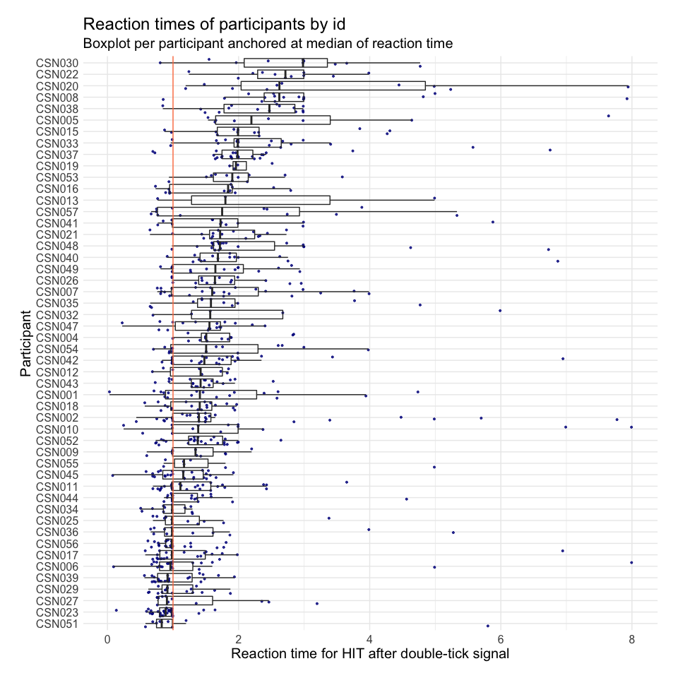

Behavioral Data Preprocessing
================
Ari Dyckovsky

  - [Load extracted behavioral data](#load-extracted-behavioral-data)
  - [Sanity checks](#sanity-checks)
  - [Combined hits dataframe for all
    participants](#combined-hits-dataframe-for-all-participants)
  - [Check out a quick preview of the table of
    hits](#check-out-a-quick-preview-of-the-table-of-hits)
  - [Check out the reaction time summary statistics by
    id:](#check-out-the-reaction-time-summary-statistics-by-id)
  - [Gut-check plot of reaction times by signal
    times](#gut-check-plot-of-reaction-times-by-signal-times)
  - [Reaction times per participant centered at the
    median](#reaction-times-per-participant-centered-at-the-median)
  - [Scale times to \[0,1\] interval for
    modeling](#scale-times-to-01-interval-for-modeling)
  - [Predict the probability of a hit by signal
    time](#predict-the-probability-of-a-hit-by-signal-time)
      - [Predict the probability of a hit by signal time with signal
        time random
        effects](#predict-the-probability-of-a-hit-by-signal-time-with-signal-time-random-effects)
  - [Predict `reaction_time` using
    `signal_time`](#predict-reaction_time-using-signal_time)

## Load extracted behavioral data

Use `tar_load` to get the target objects per participant using the
`tidyselect` syntax `starts_with` and load each object into a new
environment `envir`. Then, convert the environment to a list and map
each into a dataframe that binds rows of each participant’s data
together. This `combined_df` will include *all* participants and include
an `id` column to identify the participant individually.

``` r
withr::with_dir(here::here(), {
  combined_df <- tar_read(extracted_behavioral_data_combined)
})
```

## Sanity checks

Count of participants by unique id.

``` r
length(unique(combined_df$id))
```

    ## [1] 50

``` r
combined_df %>%
  select(trial, id, is_response, is_signal, resp_time, step_time) %>%
  group_by(id) %>%
  tally(is_response) %>%
  summarise(mean(n), sd(n), min(n), max(n))
```

    ## # A tibble: 1 x 4
    ##   `mean(n)` `sd(n)` `min(n)` `max(n)`
    ##       <dbl>   <dbl>    <int>    <int>
    ## 1      37.3    32.9        4      170

## Combined hits dataframe for all participants

The function to get each participant’s hit times vector is
`itrackvalr::get_hit_times`, and the function to get a dataframe of all
participants’ hits is `itrackvalr::get_all_hits_with_reaction_times`,
including each hit time and reaction time between that hit time and the
nearest signal prompting a response within a fixed interval.

Get the combined hits using the function:

``` r
combined_hits_df <- tar_read(all_hits_with_reaction_times)
```

## Check out a quick preview of the table of hits

``` r
knitr::kable(head(combined_hits_df, 10))
```

| trial | id     | image\_index |   signal\_time |     hit\_time | reaction\_time | is\_hit |
| ----: | :----- | -----------: | -------------: | ------------: | -------------: | ------: |
|    81 | CSN001 |          801 |  80.0604399294 |            NA |             NA |       0 |
|   117 | CSN001 |          941 | 116.0665163944 | 116.984091845 | 0.917575450165 |       1 |
|   119 | CSN001 |         3131 | 118.0679634164 |            NA |             NA |       0 |
|   211 | CSN001 |         1325 | 210.0571848214 |            NA |             NA |       0 |
|   235 | CSN001 |          752 | 234.0716901990 |            NA |             NA |       0 |
|   361 | CSN001 |          103 | 360.0647047530 |            NA |             NA |       0 |
|   461 | CSN001 |         2804 | 460.0590288559 |            NA |             NA |       0 |
|   591 | CSN001 |           28 | 590.0714484362 |            NA |             NA |       0 |
|   823 | CSN001 |          929 | 822.0630183384 | 822.772524834 | 0.709506495599 |       1 |
|   845 | CSN001 |          517 | 844.0589960678 | 845.923186561 | 1.864190493347 |       1 |

## Check out the reaction time summary statistics by id:

``` r
knitr::kable(head(
  combined_hits_df %>%
    drop_na() %>%
    group_by(id) %>%
    summarise(
      reaction_time_mean = mean(reaction_time),
      reaction_time_min = min(reaction_time),
      reaction_time_max = max(reaction_time),
      reaction_time_sd = sd(reaction_time)
    ),
  10
))
```

| id     | reaction\_time\_mean | reaction\_time\_min | reaction\_time\_max | reaction\_time\_sd |
| :----- | -------------------: | ------------------: | ------------------: | -----------------: |
| CSN001 |        1.71981596174 |      0.030177300678 |       4.73494848317 |     1.185127808038 |
| CSN002 |        1.99359213268 |      0.439399655617 |       7.77171126677 |     1.727003771770 |
| CSN004 |        1.70646593409 |      0.996316162899 |       2.84090208776 |     0.543133623999 |
| CSN005 |        3.06080474118 |      1.533621048930 |       7.64323121076 |     2.120246304387 |
| CSN006 |        1.47237477858 |      0.093593949678 |       7.99434786988 |     1.763412125625 |
| CSN007 |        1.79454994735 |      0.759996981775 |       3.99019392886 |     0.965011326176 |
| CSN008 |        3.09417513841 |      0.850421200456 |       7.92466269398 |     1.627078951623 |
| CSN009 |        1.31759492969 |      0.599157401573 |       2.19912816937 |     0.469031982754 |
| CSN010 |        2.15590923006 |      0.246194777312 |       7.99283455560 |     2.249618738692 |
| CSN011 |        1.36405598454 |      0.692828005016 |       3.64924517583 |     0.651777575973 |

## Gut-check plot of reaction times by signal times

Note the 1.000s to 1.100s gap where hits were not recorded.

``` r
combined_hits_df %>%
  drop_na() %>%
  ggplot(aes(x = signal_time, y = reaction_time)) +
    geom_point(color = 'orange') +
    geom_smooth(method=lm) +
    theme_classic()
```

<!-- -->

## Reaction times per participant centered at the median

``` r
combined_hits_df %>%
  drop_na() %>%
  arrange(reaction_time) %>%
  ggplot(aes(x = reorder(id, reaction_time, FUN = median), y = reaction_time)) +
    geom_point(alpha = 0.8, size = 0.7, color = 'darkblue', position = 'jitter') +
    geom_boxplot(alpha = 0) +
    geom_hline(yintercept = 1, color = 'coral') +
  theme_minimal() +
  theme(
    aspect.ratio = 1,
    text = element_text(size = 15),
    plot.margin = margin(18, 18, 18, 18, 'pt')
  ) +
  labs(
    title = 'Reaction times of participants by id',
    subtitle = 'Boxplot per participant anchored at median of reaction time',
    y = 'Reaction time for HIT after double-tick signal',
    x = 'Participant'
  ) +
  coord_flip()
```

<!-- -->

## Scale times to \[0,1\] interval for modeling

``` r
scaled_combined_hits_df <- combined_hits_df %>%
  mutate(
    signal_time = signal_time / 3600,
    reaction_time = reaction_time
  )
```

## Predict the probability of a hit by signal time

``` r
hit_by_signal_time_model <- function(df) {
  glmer(
    is_hit ~ 1 + signal_time + (1 | id),
    data = df,
    family = "binomial"
  )
}

model_pHit_signaltime_MFX <- hit_by_signal_time_model(scaled_combined_hits_df)

summary(model_pHit_signaltime_MFX)
```

    ## Generalized linear mixed model fit by maximum likelihood (Laplace Approximation) [glmerMod
    ## ]
    ##  Family: binomial  ( logit )
    ## Formula: is_hit ~ 1 + signal_time + (1 | id)
    ##    Data: df
    ## 
    ##      AIC      BIC   logLik deviance df.resid 
    ##   2307.5   2323.9  -1150.7   2301.5     1797 
    ## 
    ## Scaled residuals: 
    ##          Min           1Q       Median           3Q          Max 
    ## -2.494411658 -0.784968172 -0.477289551  0.902517615  2.366707656 
    ## 
    ## Random effects:
    ##  Groups Name        Variance    Std.Dev.   
    ##  id     (Intercept) 0.698673966 0.835867194
    ## Number of obs: 1800, groups:  id, 50
    ## 
    ## Fixed effects:
    ##                 Estimate   Std. Error  z value   Pr(>|z|)    
    ## (Intercept)  0.230697540  0.157237994  1.46719    0.14233    
    ## signal_time -0.859634004  0.182285149 -4.71588 2.4067e-06 ***
    ## ---
    ## Signif. codes:  0 '***' 0.001 '**' 0.01 '*' 0.05 '.' 0.1 ' ' 1
    ## 
    ## Correlation of Fixed Effects:
    ##             (Intr)
    ## signal_time -0.572

### Predict the probability of a hit by signal time with signal time random effects

``` r
#is_hit ~ 1 + signal_time + (1 + signal_time | id)
```

## Predict `reaction_time` using `signal_time`

``` r
model_RT_signaltime_MFX = lmer(
  reaction_time ~ 1 + signal_time + (1 | id),
  data = scaled_combined_hits_df %>% na.omit()
)

summary(model_RT_signaltime_MFX)
```

    ## Linear mixed model fit by REML. t-tests use Satterthwaite's method ['lmerModLmerTest']
    ## Formula: reaction_time ~ 1 + signal_time + (1 | id)
    ##    Data: scaled_combined_hits_df %>% na.omit()
    ## 
    ## REML criterion at convergence: 2463
    ## 
    ## Scaled residuals: 
    ##          Min           1Q       Median           3Q          Max 
    ## -1.856746002 -0.522942508 -0.203867491  0.199189511  5.955977930 
    ## 
    ## Random effects:
    ##  Groups   Name        Variance    Std.Dev.   
    ##  id       (Intercept) 0.253031509 0.503022374
    ##  Residual             1.067215435 1.033061196
    ## Number of obs: 821, groups:  id, 50
    ## 
    ## Fixed effects:
    ##                  Estimate    Std. Error            df  t value   Pr(>|t|)    
    ## (Intercept)   1.424493424   0.100223741 105.550683060 14.21313 < 2.22e-16 ***
    ## signal_time   0.774275825   0.128541525 793.026666766  6.02355 2.6097e-09 ***
    ## ---
    ## Signif. codes:  0 '***' 0.001 '**' 0.01 '*' 0.05 '.' 0.1 ' ' 1
    ## 
    ## Correlation of Fixed Effects:
    ##             (Intr)
    ## signal_time -0.585
