Eyetracker Data Preprocessing
================
Ari Dyckovsky

  - [Setup](#setup)
      - [Load package with
        dependencies](#load-package-with-dependencies)
      - [Load configuration settings](#load-configuration-settings)
      - [File path definitions](#file-path-definitions)
      - [Participant identification
        settings](#participant-identification-settings)
  - [Load extracted data](#load-extracted-data)
      - [Define loading methods for
        CSVs](#define-loading-methods-for-csvs)
      - [Load data for each
        participant](#load-data-for-each-participant)
  - [Events data](#events-data)
      - [Methods using `etd_events` list of loaded
        dataframes](#methods-using-etd_events-list-of-loaded-dataframes)
  - [Recordings data](#recordings-data)
      - [Methods using `etd_recordings` list of loaded
        dataframes](#methods-using-etd_recordings-list-of-loaded-dataframes)
      - [Look at recording times](#look-at-recording-times)
  - [Evaluate validation and revalidation
    quality](#evaluate-validation-and-revalidation-quality)
      - [Methods to create validation and revalidation
        dataframes](#methods-to-create-validation-and-revalidation-dataframes)
      - [Correlation tests for `avg_error` and
        `max_error`](#correlation-tests-for-avg_error-and-max_error)
      - [Methods for correlation plots](#methods-for-correlation-plots)
      - [Categorized dataframes by validation and revalidation
        conditions](#categorized-dataframes-by-validation-and-revalidation-conditions)
      - [Paired Plots](#paired-plots)
      - [Paired plots for validation-revalidation
        changes](#paired-plots-for-validation-revalidation-changes)
  - [Samples data](#samples-data)
      - [Extract samples for task
        duration](#extract-samples-for-task-duration)
  - [Playground](#playground)

## Setup

This notebook requires that the following chunks are run before any
other section chunks can resolve. Please complete the following in
order:

1.  Load the package interface with its dependencies,
2.  Load the configuration settings,
3.  Set file paths,
4.  Set participant identification settings.

### Load package with dependencies

``` r
# Load csn package with devtools
library(devtools)
load_all()

# Load dependencies
library(tidyverse)
library(ggpubr)
```

### Load configuration settings

We use a configuration file called `config.yml` to handle environment
settings, such as the absolute path to data and subdirectories by type
of data (i.e., “raw”) and participant identification details (i.e., the
prefix “CSN”). For more information on how to use configurable
environment settings, see [this introduction
vignette](https://cran.r-project.org/web/packages/config/vignettes/introduction.html).

``` r
config <- config::get()
```

### File path definitions

File path definitions are set using configured environment settings from
the `config.yml` file. (Note: overrides of configured settings should
occur within the YAML text file, usually via a new environment that
inherits defaults other than explicit overrides).

``` r
# Top level data path for entry
data_path <- config$path$data

# Extracted data subdirectory path
extracted_data_path <- file.path(data_path, 
                                 config$path$extracted)

# Extracted eyetracker data subdirectory path
extracted_eyetracker_data_path <- file.path(extracted_data_path, 
                                            config$path$eyetracker)

# Extracted eyetracker data file names (to CSV, from MAT)
event_csv <- config$extracted_files$eyetracker_event_csv
sample_csv <- config$extracted_files$eyetracker_sample_csv
ioevent_csv <- config$extracted_files$eyetracker_ioevent_csv
recordings_csv <- config$extracted_files$eyetracker_recordings_csv
```

### Participant identification settings

Participant identification settings are also use configured environment
settings from the `config.yml` file.

``` r
# Participant id settings
participant_id_prefix <- config$participant_id$prefix
participant_id_pad_length <- config$participant_id$pad_length
participant_id_pad_character <- config$participant_id$pad_character
participant_id_min <- config$participant_id$min
participant_id_max <- config$participant_id$max
```

## Load extracted data

### Define loading methods for CSVs

``` r
min_id <- participant_id_min
max_id <- participant_id_max

get_path_to_id <- function(path_to_dir, id) {
  padded_id <- stringr::str_pad(id, 
                                participant_id_pad_length, 
                                pad = participant_id_pad_character)
  participant_id <- stringr::str_c(participant_id_prefix, padded_id)
  return (
    file.path(
      path_to_dir, 
      participant_id
    )
  )
}

get_id_vector <- function(path_to_dir) {
  # Gets a vector of id integers for participants relative
  # to the existence of that participant's data (some participants
  # are not converted from raw MAT data to CSVs if not considered
  # a complete participant)
  id_vector <- c()
  for (i in min_id:max_id) {
    if ( dir.exists(get_path_to_id(path_to_dir, i)) ) {
      id_vector <- c(id_vector, i)
    }
  }
  return (id_vector)
}

load_all_etd_by_filename_csv <-function(path_to_dir, id_vector, filename_csv = sample_csv) {
  # Loads all eyetracking data of given filename across participants
  etd_list <- list()
  for (id in id_vector) {
    path_to_etd <- file.path(get_path_to_id(path_to_dir, id), filename_csv)
    etd_list[[id]] <- readr::read_csv(path_to_etd)
  }
  return (etd_list)
}

# Convenience instantiation of the id vector for later use. Can use
# the getter method at any point for same output.
id_vector <- get_id_vector(extracted_eyetracker_data_path)
```

### Load data for each participant

The following chunk loads CSVs for participants’ event, recordings, and
sample data and then assigns a list of these loaded dataframes to the
approriate `etd_*` variable.

``` r
etd_events <- load_all_etd_by_filename_csv(extracted_eyetracker_data_path, id_vector, event_csv)
etd_recordings <- load_all_etd_by_filename_csv(extracted_eyetracker_data_path, id_vector, recordings_csv)
etd_samples <- load_all_etd_by_filename_csv(extracted_eyetracker_data_path, id_vector, sample_csv)
```

## Events data

### Methods using `etd_events` list of loaded dataframes

``` r
CALIBRATION_RESULT_MESSAGE <- "!CAL CALIBRATION HV9 R RIGHT"
VALIDATION_RESULT_MESSAGE <- "!CAL VALIDATION HV9 R RIGHT"
CATEGORY_STRING_PATTERN <- "CALIBRATION|VALIDATION"
QUALITY_STRING_PATTERN <- "GOOD|FAIR|POOR"
AVG_ERROR_STRING_INDEX <- 8
MAX_ERROR_STRING_INDEX <- 10
DEG_OFFSET_STRING_INDEX <- 13
PIX_OFFSET_STRING_INDEX <- 15


get_category_from_message <- function(message) {
  # Extract the category of event message
  as.character(str_extract(message, CATEGORY_STRING_PATTERN))
}


get_quality_from_message <- function(message) {
  # Extract the quality of calibration or validation from event message
  as.character(str_extract(message, QUALITY_STRING_PATTERN))
}


get_avg_error_from_message <- function(message) {
  # Extract the avg error of validation
  as.double(word(message, AVG_ERROR_STRING_INDEX))
}


get_max_error_from_message <- function(message) {
  # Extract the max error of validation
  as.double(word(message, MAX_ERROR_STRING_INDEX))
}


get_deg_offset_from_message <- function(message) {
  # Extract the deg offset of validation
  as.double(word(message, DEG_OFFSET_STRING_INDEX))
}


get_pix_offset_from_message <- function(message) {
  # Extract the x coordinate of pix offset of validation
  word(message, PIX_OFFSET_STRING_INDEX)
}


get_event_messages <- function(participant_events) {
  # Get the significant event messages for a single participant
  # events data by sttime, producing the extracted rows and columns 
  # from message contents.
  
  if ("df" %in% ls()) rm("df")
  
  # Select desired columns and remove white space around message
  df <- participant_events %>%
    select(message, sttime) %>%
    transmute(message = str_squish(str_trim(message)), sttime = sttime) 
  
  # Extract rows from categorized event result messages
  df <- df %>%
    filter(str_detect(message, CALIBRATION_RESULT_MESSAGE) | str_detect(message, VALIDATION_RESULT_MESSAGE)) %>%
    mutate(
      category = get_category_from_message(message),
      quality = get_quality_from_message(message),
      avg_error = get_avg_error_from_message(message),
      max_error = get_max_error_from_message(message),
      deg_offset = get_deg_offset_from_message(message),
      pix_offset = get_pix_offset_from_message(message)
    ) 
  
  # Extract columns for pixel offsets of x,y coordinates
  df <- df %>%
    separate(pix_offset, c("pix_x_offset", "pix_y_offset"), ",") %>%
    mutate(
      pix_x_offset = as.double(pix_x_offset),
      pix_y_offset = as.double(pix_y_offset)
    ) 
  
  # Move message column to last column for convenient notebook 
  # reading of dataframe output
  df <- df %>%
    relocate(-message)
  
  return (df)
  
}
```

Output of a single participant’s calibration/validation event data.

``` r
make_pretty_df(
  get_event_messages(etd_events[[5]])
)
```

|    sttime | category    | quality | avg\_error | max\_error | deg\_offset | pix\_x\_offset | pix\_y\_offset | message                                                                                     |
| --------: | :---------- | :------ | ---------: | ---------: | ----------: | -------------: | -------------: | :------------------------------------------------------------------------------------------ |
| 2,475,622 | CALIBRATION | GOOD    |         NA |         NA |          NA |             NA |             NA | \!CAL CALIBRATION HV9 R RIGHT GOOD                                                          |
| 2,499,059 | VALIDATION  | GOOD    |       0.44 |       1.11 |        0.11 |          \-4.4 |          \-1.9 | \!CAL VALIDATION HV9 R RIGHT GOOD ERROR 0.44 avg. 1.11 max OFFSET 0.11 deg. -4.4,-1.9 pix.  |
| 6,231,071 | VALIDATION  | GOOD    |       0.85 |       1.13 |        0.70 |          \-3.6 |           32.7 | \!CAL VALIDATION HV9 R RIGHT GOOD ERROR 0.85 avg. 1.13 max OFFSET 0.70 deg. -3.6,32.7 pix.  |
| 6,269,103 | VALIDATION  | GOOD    |       0.82 |       1.03 |        0.64 |         \-20.0 |           21.0 | \!CAL VALIDATION HV9 R RIGHT GOOD ERROR 0.82 avg. 1.03 max OFFSET 0.64 deg. -20.0,21.0 pix. |

## Recordings data

### Methods using `etd_recordings` list of loaded dataframes

``` r
get_duration <- function(id) {
  # Duration from highest start time and lowest start time, in minutes
  summary <- etd_recordings[[id]] %>% 
    summarize(duration = (max(time) - min(time)) / (1000*60) ) %>%
    unnest(cols = c())
  return(summary$duration)
}

get_durations <- function(id_vector) {
  # Durations in minutes for all participants events' data
  durations <- c()
  for (i in id_vector) {
    durations <- c(durations, get_duration(i))
  }
  return(durations)
}

get_recording_time_matrix <- function(id_vector, dimensional_reducer = 1) {
  # Get a built matrix with a row for each id in id_vector, with four
  # times per row. Optional dimensional reducer to achieve times in seconds, minutes.
  n_ids <- length(id_vector)
  n_recordings <- 1 + length(etd_recordings[[id_vector[[1]]]]$time)
  recording_time_matrix <- matrix(NA, nrow=n_ids, ncol=n_recordings)
  
  for (i in 1:n_ids) {
    id <- id_vector[i]
    recording_time_matrix[i,] <- c(id, (etd_recordings[[id]]$time / dimensional_reducer))
  }
  
  return(recording_time_matrix)
  
}

get_recording_time_df <- function(id_vector, dimensional_reducer = 1) {
  # Get dataframe using matrix of ids and times from recordings. Optional
  # dimensional reducer to achieve times in seconds, minutes.
  m <- get_recording_time_matrix(id_vector, dimensional_reducer)
  df <- as.data.frame(m)
  recording_time_df_cols <- c("id", "calibration", "validation", "task", "revalidation")
  colnames(df) <- recording_time_df_cols
  
  return(df)
  
}
```

### Look at recording times

Can retrieve all recording moments across participants by seconds or
minutes. In seconds, the difference between revalidation and task time,
then subtracting 3600, provides an idea of how much “overtime” the task
went.

``` r
recording_time_df_seconds <- get_recording_time_df(id_vector, 1000)
recording_time_df_minutes <- get_recording_time_df(id_vector, 1000 * 60)

sort(recording_time_df_seconds$revalidation - recording_time_df_seconds$task - 3600)
```

    ##  [1]  25.149  28.309  31.267  31.483  31.733  32.517  32.635  33.821  34.419
    ## [10]  38.285  39.071  39.623  40.975  44.711  44.805  45.775  45.877  46.277
    ## [19]  47.045  48.175  49.093  49.677  50.481  52.581  53.299  55.383  56.825
    ## [28]  59.169  63.325  64.039  72.231  73.695  74.839  79.483  79.915  80.015
    ## [37]  84.351  95.241  99.463 113.003 115.135 116.207 135.669 139.489 145.689
    ## [46] 155.581 212.885 240.137 263.149

## Evaluate validation and revalidation quality

### Methods to create validation and revalidation dataframes

``` r
get_val_reval_by_id <- function(recording_time_df, i) {
  
  recording_times_for_id <- recording_time_df %>%
    filter(id == i)
  
  all_validations_by_id <- get_event_messages(etd_events[[i]]) %>%
    filter(category == "VALIDATION") %>%
    select(-c(message, category))

  validation <- all_validations_by_id %>%
    filter(sttime < recording_times_for_id$task) %>%
    arrange(sttime) %>%
    slice_tail(n = 1) %>%
    mutate(id = as.integer(i)) %>%
    relocate(id) %>%
    rename_with(~ paste(.x, "val", sep = "_"), -id)
    
  revalidation <- all_validations_by_id %>%
    filter(sttime > (recording_times_for_id$task + 60 * 60 * 1000)) %>%
    arrange(sttime) %>%
    slice_tail(n = 1) %>%
    mutate(id = as.integer(i)) %>%
    relocate(id) %>%
    rename_with(~ paste(.x, "reval", sep = "_"), -id)
  
  left_join(
    validation,
    revalidation,
    by = c("id")
  )
  
}


get_all_val_reval_df <- function(id_vector) {
  
  if ("df" %in% ls()) rm("df")
  
  df <- data.frame()
  
  recording_time_df <- get_recording_time_df(id_vector)
  
  for (i in id_vector) {
    val_reval_df <- get_val_reval_by_id(recording_time_df, i)
    df <- bind_rows(df, val_reval_df)
  }
  
  return(df)
}

get_recording_and_val_reval_df <- function(recording_time_df, all_val_reval_df) {
  
  left_join(
    recording_time_df, 
    all_val_reval_df,
    by = c("id")
  )
  
}
```

#### Combine recording times with significant event details per participant

``` r
recording_time_df <- get_recording_time_df(id_vector)
all_val_reval_df <- get_all_val_reval_df(id_vector)

recording_and_val_reval_df <- get_recording_and_val_reval_df(recording_time_df, all_val_reval_df)
```

Visulaize the head of the dataframe:

``` r
make_pretty_df(
  head(recording_and_val_reval_df, 10)
)
```

| id | calibration | validation |       task | revalidation | sttime\_val | quality\_val | avg\_error\_val | max\_error\_val | deg\_offset\_val | pix\_x\_offset\_val | pix\_y\_offset\_val | sttime\_reval | quality\_reval | avg\_error\_reval | max\_error\_reval | deg\_offset\_reval | pix\_x\_offset\_reval | pix\_y\_offset\_reval |
| -: | ----------: | ---------: | ---------: | -----------: | ----------: | :----------- | --------------: | --------------: | ---------------: | ------------------: | ------------------: | ------------: | :------------- | ----------------: | ----------------: | -----------------: | --------------------: | --------------------: |
|  1 |     881,864 |    881,939 |  1,335,826 |    5,081,515 |   1,195,390 | POOR         |            2.05 |            9.27 |             1.46 |                39.3 |                40.9 |     5,115,802 | POOR           |              2.25 |              8.98 |               1.44 |                  55.1 |                  30.7 |
|  2 |   1,330,220 |  1,330,285 |  2,036,216 |    5,899,365 |   1,909,910 | POOR         |            1.54 |            3.32 |             0.56 |              \-16.7 |              \-16.3 |     5,928,119 | POOR           |              2.95 |              3.70 |               1.66 |                 \-9.1 |                  76.2 |
|  4 |   1,237,276 |  1,237,353 |  1,840,796 |    5,653,681 |   1,769,410 | GOOD         |            0.84 |            1.10 |             0.36 |                15.2 |                 3.2 |     5,689,157 | GOOD           |              0.88 |              1.17 |               0.49 |                  10.5 |                  18.3 |
|  5 |   2,173,786 |  2,173,859 |  2,554,346 |    6,199,151 |   2,499,059 | GOOD         |            0.44 |            1.11 |             0.11 |               \-4.4 |               \-1.9 |     6,269,103 | GOOD           |              0.82 |              1.03 |               0.64 |                \-20.0 |                  21.0 |
|  6 |   7,524,796 |  7,524,855 |  7,935,316 |   11,670,985 |   7,870,548 | GOOD         |            0.21 |            0.42 |             0.06 |               \-0.7 |                 2.4 |    11,702,118 | GOOD           |              0.62 |              0.98 |               0.57 |                \-14.8 |                  17.7 |
|  7 |   1,665,884 |  1,665,951 |  2,051,128 |    5,764,131 |   1,975,331 | GOOD         |            0.26 |            0.43 |             0.15 |                 0.4 |                 6.1 |     5,793,871 | GOOD           |              0.72 |              1.33 |               0.64 |                 \-7.6 |                  25.3 |
|  8 |   2,236,502 |  2,236,561 |  2,722,916 |    6,407,267 |   2,661,415 | FAIR         |            0.89 |            1.59 |             0.26 |                 3.2 |                 9.8 |     6,428,591 | POOR           |              1.18 |              3.93 |               1.02 |                  31.9 |                  14.5 |
|  9 |  12,714,578 | 12,714,637 | 12,986,604 |   16,661,443 |  12,929,488 | GOOD         |            0.54 |            1.44 |             0.40 |               \-2.4 |                17.9 |    16,683,293 | FAIR           |              0.74 |              1.73 |               0.38 |                  10.6 |                \-14.5 |
| 10 |   1,653,320 |  1,653,401 |  2,587,336 |    6,233,213 |   2,526,494 | POOR         |            0.84 |            2.31 |             0.37 |                13.5 |               \-6.2 |     6,253,298 | POOR           |              2.09 |              4.75 |               1.89 |                \-34.7 |                \-81.7 |
| 11 |   1,071,538 |  1,071,611 |  1,346,862 |    5,061,997 |   1,247,087 | POOR         |            0.84 |            3.07 |             0.73 |                17.7 |              \-24.3 |     5,083,297 | POOR           |              4.70 |             21.47 |               4.29 |                 129.0 |               \-107.7 |

Mutate to get change in average error, max error, and pixel offsets.

``` r
val_reval_changes_df <- recording_and_val_reval_df %>%
    mutate(
      avg_error_change = avg_error_reval - avg_error_val,
      max_error_change = max_error_reval - max_error_val,
      pix_x_offset_change = pix_x_offset_reval - pix_x_offset_val,
      pix_y_offset_change = pix_y_offset_reval - pix_y_offset_val
    ) %>%
    relocate(c(avg_error_change, max_error_change, pix_x_offset_change, pix_y_offset_change), .after = id) %>%
    arrange(abs(avg_error_change))

make_pretty_df(
  val_reval_changes_df
)
```

| id | avg\_error\_change | max\_error\_change | pix\_x\_offset\_change | pix\_y\_offset\_change | calibration | validation |       task | revalidation | sttime\_val | quality\_val | avg\_error\_val | max\_error\_val | deg\_offset\_val | pix\_x\_offset\_val | pix\_y\_offset\_val | sttime\_reval | quality\_reval | avg\_error\_reval | max\_error\_reval | deg\_offset\_reval | pix\_x\_offset\_reval | pix\_y\_offset\_reval |
| -: | -----------------: | -----------------: | ---------------------: | ---------------------: | ----------: | ---------: | ---------: | -----------: | ----------: | :----------- | --------------: | --------------: | ---------------: | ------------------: | ------------------: | ------------: | :------------- | ----------------: | ----------------: | -----------------: | --------------------: | --------------------: |
| 21 |             \-0.01 |               1.47 |                 \-24.4 |                 \-25.4 |   1,774,038 |  1,774,103 |  2,252,886 |    5,952,349 |   2,095,959 | POOR         |            1.32 |            2.64 |             1.18 |                26.9 |                48.3 |     6,111,905 | POOR           |              1.31 |              4.11 |               0.55 |                   2.5 |                  22.9 |
| 52 |               0.03 |             \-0.82 |                    2.5 |                   15.4 |   1,304,788 |  1,304,855 |  1,521,416 |    5,176,799 |   1,467,984 | FAIR         |            0.56 |            1.60 |             0.25 |                 3.8 |               \-9.4 |     5,205,726 | GOOD           |              0.59 |              0.78 |               0.21 |                   6.3 |                   6.0 |
|  4 |               0.04 |               0.07 |                  \-4.7 |                   15.1 |   1,237,276 |  1,237,353 |  1,840,796 |    5,653,681 |   1,769,410 | GOOD         |            0.84 |            1.10 |             0.36 |                15.2 |                 3.2 |     5,689,157 | GOOD           |              0.88 |              1.17 |               0.49 |                  10.5 |                  18.3 |
| 18 |             \-0.06 |               0.75 |                  \-2.2 |                   34.7 |   1,878,264 |  1,878,319 |  2,176,006 |    5,871,247 |   2,131,274 | FAIR         |            1.06 |            1.72 |             0.76 |                24.4 |              \-18.0 |     5,898,916 | POOR           |              1.00 |              2.47 |               0.73 |                  22.2 |                  16.7 |
| 38 |             \-0.09 |             \-0.17 |                    5.6 |                    1.0 |   7,163,188 |  7,163,245 |  7,525,292 |   11,157,809 |   7,464,045 | GOOD         |            0.49 |            1.40 |             0.41 |              \-11.9 |              \-14.1 |    11,180,287 | GOOD           |              0.40 |              1.23 |               0.32 |                 \-6.3 |                \-13.1 |
| 26 |               0.14 |               0.27 |                   20.5 |                 \-17.8 |   2,270,082 |  2,270,145 |  2,675,926 |    6,324,101 |   2,597,140 | GOOD         |            0.58 |            0.97 |             0.46 |              \-15.3 |               \-6.5 |     6,362,123 | GOOD           |              0.72 |              1.24 |               0.59 |                   5.2 |                \-24.3 |
| 23 |             \-0.15 |               0.22 |                   11.5 |                    3.9 |   1,045,664 |  1,045,729 |  1,247,312 |    4,893,087 |   1,218,359 | FAIR         |            0.96 |            1.93 |             0.93 |              \-12.7 |              \-37.9 |     4,917,114 | POOR           |              0.81 |              2.15 |               0.77 |                 \-1.2 |                \-34.0 |
| 54 |             \-0.19 |               1.48 |                   29.0 |                   26.6 |     949,944 |    950,013 |  1,503,486 |    5,135,219 |   1,460,781 | FAIR         |            1.01 |            1.57 |             0.67 |              \-16.0 |              \-18.7 |     5,156,673 | POOR           |              0.82 |              3.05 |               0.39 |                  13.0 |                   7.9 |
|  9 |               0.20 |               0.29 |                   13.0 |                 \-32.4 |  12,714,578 | 12,714,637 | 12,986,604 |   16,661,443 |  12,929,488 | GOOD         |            0.54 |            1.44 |             0.40 |               \-2.4 |                17.9 |    16,683,293 | FAIR           |              0.74 |              1.73 |               0.38 |                  10.6 |                \-14.5 |
| 12 |             \-0.20 |             \-0.51 |                   10.7 |                   47.7 |   1,124,654 |  1,124,721 |  1,487,916 |    5,160,147 |   1,448,114 | GOOD         |            0.86 |            1.35 |             0.76 |              \-12.6 |              \-26.8 |     5,192,924 | GOOD           |              0.66 |              0.84 |               0.50 |                 \-1.9 |                  20.9 |
|  1 |               0.20 |             \-0.29 |                   15.8 |                 \-10.2 |     881,864 |    881,939 |  1,335,826 |    5,081,515 |   1,195,390 | POOR         |            2.05 |            9.27 |             1.46 |                39.3 |                40.9 |     5,115,802 | POOR           |              2.25 |              8.98 |               1.44 |                  55.1 |                  30.7 |
| 43 |               0.21 |               1.39 |                   28.3 |                 \-20.0 |     730,520 |    730,595 |    909,672 |    4,544,091 |     846,280 | GOOD         |            0.68 |            0.98 |             0.33 |               \-8.5 |              \-12.3 |     4,567,038 | POOR           |              0.89 |              2.37 |               0.82 |                  19.8 |                \-32.3 |
| 39 |               0.22 |               0.25 |                  \-0.1 |                   16.8 |   2,126,800 |  2,126,879 |  2,214,578 |    5,861,623 |   2,164,086 | GOOD         |            0.53 |            0.94 |             0.47 |                16.3 |                 8.3 |     6,143,466 | GOOD           |              0.75 |              1.19 |               0.71 |                  16.2 |                  25.1 |
| 25 |               0.23 |               0.19 |                    6.6 |                   33.8 |   1,249,028 |  1,249,091 |  1,570,970 |    5,250,885 |   1,471,275 | GOOD         |            0.64 |            0.99 |             0.41 |              \-14.2 |               \-7.4 |     5,292,966 | GOOD           |              0.87 |              1.18 |               0.71 |                 \-7.6 |                  26.4 |
| 49 |               0.25 |               1.49 |                   16.1 |                    7.1 |   6,982,698 |  6,982,759 |  7,209,750 |   10,834,899 |   7,168,814 | GOOD         |            0.59 |            1.22 |             0.50 |               \-0.8 |                19.4 |    10,854,898 | POOR           |              0.84 |              2.71 |               0.72 |                  15.3 |                  26.5 |
| 42 |               0.28 |               0.38 |                   10.9 |                 \-33.7 |   2,133,614 |  2,133,673 |  2,390,322 |    6,031,297 |   2,349,859 | GOOD         |            0.55 |            1.40 |             0.31 |               \-7.3 |                10.4 |     6,057,399 | FAIR           |              0.83 |              1.78 |               0.57 |                   3.6 |                \-23.3 |
|  8 |               0.29 |               2.34 |                   28.7 |                    4.7 |   2,236,502 |  2,236,561 |  2,722,916 |    6,407,267 |   2,661,415 | FAIR         |            0.89 |            1.59 |             0.26 |                 3.2 |                 9.8 |     6,428,591 | POOR           |              1.18 |              3.93 |               1.02 |                  31.9 |                  14.5 |
| 34 |             \-0.31 |               0.29 |                  \-1.1 |                 \-21.6 |     730,156 |    730,235 |  1,761,032 |    5,407,309 |   1,660,381 | GOOD         |            0.79 |            1.10 |             0.58 |                 8.9 |                23.5 |     5,425,374 | GOOD           |              0.48 |              1.39 |               0.18 |                   7.8 |                   1.9 |
|  5 |               0.38 |             \-0.08 |                 \-15.6 |                   22.9 |   2,173,786 |  2,173,859 |  2,554,346 |    6,199,151 |   2,499,059 | GOOD         |            0.44 |            1.11 |             0.11 |               \-4.4 |               \-1.9 |     6,269,103 | GOOD           |              0.82 |              1.03 |               0.64 |                \-20.0 |                  21.0 |
|  6 |               0.41 |               0.56 |                 \-14.1 |                   15.3 |   7,524,796 |  7,524,855 |  7,935,316 |   11,670,985 |   7,870,548 | GOOD         |            0.21 |            0.42 |             0.06 |               \-0.7 |                 2.4 |    11,702,118 | GOOD           |              0.62 |              0.98 |               0.57 |                \-14.8 |                  17.7 |
| 16 |               0.41 |               8.53 |                   40.9 |                 \-38.2 |   8,007,176 |  8,007,241 |  8,290,424 |   11,953,749 |   8,255,843 | GOOD         |            0.88 |            1.18 |             0.74 |               \-6.4 |                26.1 |    11,979,423 | POOR           |              1.29 |              9.71 |               1.15 |                  34.5 |                \-12.1 |
| 30 |               0.42 |               0.00 |                    3.3 |                    8.2 |   2,338,996 |  2,339,053 |  2,432,284 |    6,112,299 |   2,381,860 | GOOD         |            0.39 |            0.92 |             0.07 |                 0.1 |                 3.0 |     6,135,741 | GOOD           |              0.81 |              0.92 |               0.26 |                   3.4 |                  11.2 |
|  7 |               0.46 |               0.90 |                  \-8.0 |                   19.2 |   1,665,884 |  1,665,951 |  2,051,128 |    5,764,131 |   1,975,331 | GOOD         |            0.26 |            0.43 |             0.15 |                 0.4 |                 6.1 |     5,793,871 | GOOD           |              0.72 |              1.33 |               0.64 |                 \-7.6 |                  25.3 |
| 19 |               0.47 |               0.23 |                   31.6 |                 \-41.8 |   1,512,960 |  1,513,023 |  1,838,636 |    5,466,945 |   1,782,491 | GOOD         |            0.40 |            1.00 |             0.27 |               \-5.4 |                10.8 |     5,517,377 | GOOD           |              0.87 |              1.23 |               0.79 |                  26.2 |                \-31.0 |
| 44 |               0.48 |               0.77 |                   28.7 |                   22.3 |   2,754,202 |  2,754,261 |  3,025,672 |    6,670,383 |   2,967,643 | FAIR         |            0.61 |            1.65 |             0.17 |               \-3.0 |                 6.1 |     6,724,748 | POOR           |              1.09 |              2.42 |               0.86 |                  25.7 |                  28.4 |
| 51 |               0.50 |               0.49 |                   11.6 |                   20.8 |     963,978 |    964,039 |  1,162,098 |    4,793,365 |   1,091,056 | GOOD         |            0.57 |            0.79 |             0.44 |                17.1 |                 3.7 |     4,813,281 | FAIR           |              1.07 |              1.28 |               0.93 |                  28.7 |                  24.5 |
| 29 |               0.55 |               0.89 |                   19.0 |                   36.2 |   2,218,926 |  2,218,989 |  2,463,750 |    6,127,789 |   2,409,855 | FAIR         |            1.07 |            1.30 |             0.89 |              \-23.5 |                32.8 |     6,150,941 | POOR           |              1.62 |              2.19 |               1.44 |                 \-4.5 |                  69.0 |
| 20 |               0.60 |             \-0.07 |                   27.4 |                   13.8 |   1,519,158 |  1,519,233 |  1,904,632 |    5,554,309 |   1,855,358 | POOR         |            1.64 |            3.45 |             0.95 |                22.8 |                25.5 |     5,573,882 | POOR           |              2.24 |              3.38 |               1.76 |                  50.2 |                  39.3 |
| 41 |               0.63 |               0.73 |                 \-32.7 |                   14.6 |   7,257,234 |  7,257,297 |  7,647,212 |   11,363,419 |   7,490,599 | FAIR         |            0.60 |            1.55 |             0.23 |                10.2 |                 1.6 |    11,476,259 | POOR           |              1.23 |              2.28 |               0.70 |                \-22.5 |                  16.2 |
| 47 |               0.70 |               2.30 |                   21.9 |                   67.7 |     144,138 |    144,205 |    355,892 |    4,111,473 |     315,401 | GOOD         |            0.70 |            1.36 |             0.35 |                 4.7 |              \-15.7 |     4,132,569 | POOR           |              1.40 |              3.66 |               1.19 |                  26.6 |                  52.0 |
| 32 |               0.71 |               0.95 |                    4.8 |                 \-36.3 |   2,246,952 |  2,247,023 |  2,450,194 |    6,189,683 |   2,361,135 | GOOD         |            0.57 |            1.19 |             0.36 |              \-11.7 |               \-7.0 |     6,270,702 | POOR           |              1.28 |              2.14 |               1.05 |                 \-6.9 |                \-43.3 |
| 48 |               0.72 |               0.45 |                   36.8 |                 \-18.6 |     591,876 |    591,941 |  1,039,962 |    4,672,597 |     994,193 | GOOD         |            0.57 |            1.16 |             0.10 |                 3.2 |               \-2.6 |     4,691,363 | FAIR           |              1.29 |              1.61 |               1.13 |                  40.0 |                \-21.2 |
| 57 |               0.78 |               1.40 |                 \-29.0 |                   38.1 |   6,965,480 |  6,965,545 |  7,173,636 |   11,013,773 |   7,114,193 | GOOD         |            0.51 |            1.25 |             0.11 |               \-2.2 |                 4.1 |    11,031,374 | POOR           |              1.29 |              2.65 |               1.18 |                \-31.2 |                  42.2 |
| 37 |               0.79 |               0.72 |                  \-2.6 |                   47.9 |   1,125,962 |  1,126,029 |  1,543,592 |    5,183,215 |   1,508,328 | POOR         |            1.20 |            4.92 |             0.14 |               \-2.5 |                 4.7 |     5,202,251 | POOR           |              1.99 |              5.64 |               1.37 |                 \-5.1 |                  52.6 |
| 56 |               0.82 |               0.15 |                  \-4.5 |                   42.8 |     905,592 |    905,671 |  1,072,892 |    4,729,717 |   1,023,642 | FAIR         |            0.33 |            1.57 |             0.22 |                 6.3 |               \-7.0 |     4,788,218 | FAIR           |              1.15 |              1.72 |               0.88 |                   1.8 |                  35.8 |
| 55 |               0.94 |               2.56 |                    2.5 |                 \-80.3 |     875,562 |    875,629 |  1,150,236 |    4,800,717 |   1,091,738 | GOOD         |            0.98 |            1.40 |             0.66 |                25.1 |                 3.3 |     4,819,370 | POOR           |              1.92 |              3.96 |               1.76 |                  27.6 |                \-77.0 |
| 40 |               1.02 |               3.28 |                 \-27.5 |                 \-65.9 |     875,946 |    876,009 |  1,191,434 |    4,865,129 |   1,116,535 | FAIR         |            0.71 |            1.62 |             0.52 |               \-7.2 |                19.1 |     4,908,090 | POOR           |              1.73 |              4.90 |               1.60 |                \-34.7 |                \-46.8 |
| 53 |               1.10 |               2.33 |                   59.4 |                   27.9 |   8,528,702 |  8,528,763 |  8,732,690 |   12,366,511 |   8,646,308 | GOOD         |            0.69 |            1.46 |             0.25 |               \-0.5 |                 9.3 |    12,417,071 | POOR           |              1.79 |              3.79 |               1.71 |                  58.9 |                  37.2 |
| 22 |               1.14 |               0.53 |                    7.0 |                 \-90.9 |   7,712,500 |  7,712,561 |  8,218,794 |   11,867,887 |   8,187,199 | POOR         |            0.96 |            2.04 |             0.55 |                22.7 |                 8.5 |    11,887,950 | POOR           |              2.10 |              2.57 |               2.02 |                  29.7 |                \-82.4 |
| 10 |               1.25 |               2.44 |                 \-48.2 |                 \-75.5 |   1,653,320 |  1,653,401 |  2,587,336 |    6,233,213 |   2,526,494 | POOR         |            0.84 |            2.31 |             0.37 |                13.5 |               \-6.2 |     6,253,298 | POOR           |              2.09 |              4.75 |               1.89 |                \-34.7 |                \-81.7 |
| 36 |               1.25 |               1.26 |                 \-41.1 |                 \-47.9 |   1,792,202 |  1,792,271 |  2,072,262 |    5,724,843 |   1,999,466 | GOOD         |            0.56 |            1.26 |             0.35 |                 8.6 |               \-9.3 |     5,758,481 | POOR           |              1.81 |              2.52 |               1.76 |                \-32.5 |                \-57.2 |
| 33 |               1.34 |               1.59 |                 \-58.6 |                 \-23.1 |   1,034,034 |  1,034,097 |  1,132,234 |    4,785,533 |   1,076,788 | GOOD         |            0.49 |            0.84 |             0.26 |                 0.3 |              \-11.9 |     4,809,206 | POOR           |              1.83 |              2.43 |               1.77 |                \-58.3 |                \-35.0 |
| 45 |               1.40 |              10.09 |                   68.7 |                  \-3.5 |   6,624,006 |  6,624,071 |  6,822,626 |   10,454,109 |   6,778,190 | GOOD         |            0.19 |            0.42 |             0.05 |               \-0.3 |               \-2.4 |    10,482,390 | POOR           |              1.59 |             10.51 |               1.50 |                  68.4 |                 \-5.9 |
|  2 |               1.41 |               0.38 |                    7.6 |                   92.5 |   1,330,220 |  1,330,285 |  2,036,216 |    5,899,365 |   1,909,910 | POOR         |            1.54 |            3.32 |             0.56 |              \-16.7 |              \-16.3 |     5,928,119 | POOR           |              2.95 |              3.70 |               1.66 |                 \-9.1 |                  76.2 |
| 15 |               1.45 |               2.32 |                 \-79.9 |                 \-15.0 |     837,690 |    837,753 |  1,236,256 |    4,874,541 |   1,189,741 | GOOD         |            0.75 |            0.96 |             0.51 |               \-2.4 |                18.9 |     4,895,318 | POOR           |              2.20 |              3.28 |               2.12 |                \-82.3 |                   3.9 |
| 35 |               1.48 |               0.56 |                 \-83.9 |                  \-3.0 |   1,925,192 |  1,925,273 |  2,138,940 |    5,818,423 |   2,077,112 | FAIR         |            0.53 |            1.81 |             0.41 |                 9.9 |                12.9 |     5,839,338 | POOR           |              2.01 |              2.37 |               1.91 |                \-74.0 |                   9.9 |
| 17 |               1.48 |               0.10 |                 \-67.2 |                   47.2 |  14,292,540 | 14,292,591 | 14,565,532 |   18,224,701 |  14,512,561 | POOR         |            0.57 |            2.54 |             0.44 |                 6.8 |                15.8 |    18,246,979 | POOR           |              2.05 |              2.64 |               1.98 |                \-60.4 |                  63.0 |
| 27 |               1.74 |               2.19 |                 \-73.9 |                  \-0.1 |   2,756,622 |  2,756,703 |  3,214,436 |    6,853,507 |   3,095,729 | POOR         |            1.59 |            4.61 |             1.43 |              \-39.6 |                44.0 |     6,875,392 | POOR           |              3.33 |              6.80 |               3.15 |               \-113.5 |                  43.9 |
| 11 |               3.86 |              18.40 |                  111.3 |                 \-83.4 |   1,071,538 |  1,071,611 |  1,346,862 |    5,061,997 |   1,247,087 | POOR         |            0.84 |            3.07 |             0.73 |                17.7 |              \-24.3 |     5,083,297 | POOR           |              4.70 |             21.47 |               4.29 |                 129.0 |               \-107.7 |

### Correlation tests for `avg_error` and `max_error`

Compare the average error between validation and revalidation across
participants using a Pearson’s product-moment correlation. Do the same
for max error.

``` r
low_avg_error_df <- val_reval_changes_df %>%
  filter(avg_error_change < 7)

avg_error_corr <- cor.test(
  low_avg_error_df$avg_error_val, 
  low_avg_error_df$avg_error_reval,
  method = "pearson",
  use = "complete.obs"
)

max_error_corr <- cor.test(
  low_avg_error_df$max_error_val, 
  low_avg_error_df$max_error_reval,
  method = "pearson",
  use = "complete.obs"
)

avg_error_corr
```

    ## 
    ##  Pearson's product-moment correlation
    ## 
    ## data:  low_avg_error_df$avg_error_val and low_avg_error_df$avg_error_reval
    ## t = 3.8299, df = 47, p-value = 0.0003787
    ## alternative hypothesis: true correlation is not equal to 0
    ## 95 percent confidence interval:
    ##  0.2393344 0.6761731
    ## sample estimates:
    ##       cor 
    ## 0.4877082

``` r
max_error_corr
```

    ## 
    ##  Pearson's product-moment correlation
    ## 
    ## data:  low_avg_error_df$max_error_val and low_avg_error_df$max_error_reval
    ## t = 3.1812, df = 47, p-value = 0.002599
    ## alternative hypothesis: true correlation is not equal to 0
    ## 95 percent confidence interval:
    ##  0.1584750 0.6278044
    ## sample estimates:
    ##       cor 
    ## 0.4209145

### Methods for correlation plots

``` r
get_error_correlation_plot <- function(df, measure) {
  
  ggscatter(
    data = df, 
    x = str_glue("{ measure }_error_val"), 
    y = str_glue("{ measure }_error_reval"),
    add = "reg.line",
    add.params = list(color = "blue", fill = "lightgray"),
    conf.int = TRUE
  ) +
  coord_fixed(ratio = 1) +
  geom_abline() +
  stat_cor(method = "pearson") +
  theme_classic2() +
  labs(
    title = tools::toTitleCase(str_glue("Correlation of { measure } error between validation and revalidation")),
    x = tools::toTitleCase(str_glue("{ measure } Error of Validation")),
    y = tools::toTitleCase(str_glue("{ measure } Error of Revalidation"))
  )
  
}

get_offset_correlation_plot <- function(df, measure) {
  
  ggscatter(
    data = df, 
    x = str_glue("pix_{ measure }_offset_val"), 
    y = str_glue("pix_{ measure }_offset_reval"),
    add = "reg.line",
    add.params = list(color = "blue", fill = "lightgray"),
    conf.int = TRUE
  ) +
  stat_cor(method = "pearson") +
  theme_classic2() +
  labs(
    title = tools::toTitleCase(str_glue("Pixel offset ({ measure }) changes between validation and revalidation")),
    x = tools::toTitleCase(str_glue("{ measure } Offset in Validation (px)")),
    y = tools::toTitleCase(str_glue("{ measure } Offset in Revalidation (px)"))
  ) 
  
}

get_offset_boxplot <- function(df, group, measure) {
  
  ggboxplot(
    data = df,
    x = str_glue("{ group }"),
    y = str_glue("{ measure }"),
    color = str_glue("{ group }"),
    order = c("val", "reval")
  ) +
  theme_classic2() +
  labs(
    title = tools::toTitleCase(str_glue("Pixel offset ({ measure }) from validation to revalidation"))
  ) 
  
}
```

``` r
get_error_correlation_plot(val_reval_changes_df, "avg")
```

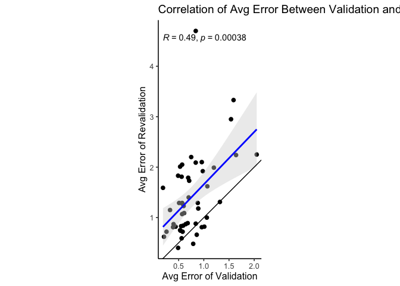<!-- -->

``` r
get_error_correlation_plot(val_reval_changes_df, "max")
```

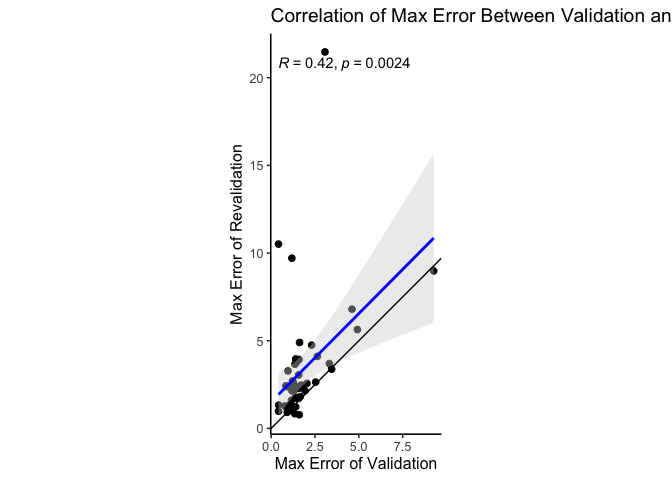<!-- -->

### Categorized dataframes by validation and revalidation conditions

Create a categorized offset dataframe and then show and example of it.

``` r
categorized_offset_df <- val_reval_changes_df %>%
  select(id, matches("pix"), -matches("change")) %>% # remove offset change columns
  pivot_longer(
    cols = -c(id), # don't select for id
    names_to = c(".value", "category"),
    names_pattern = "pix_(.)_offset_(.*)"
  ) %>%
  group_by(id) %>%
  mutate(
    distance = sqrt(x^2 + y^2)
  ) %>%
  mutate(
    x_change = x[category == "reval"] - x[category == "val"],
    y_change = y[category == "reval"] - y[category == "val"],
    distance_change = distance[category == "reval"] - distance[category == "val"]
  )

make_pretty_df(
  head(categorized_offset_df)
)
```

| id | category |    x |     y | distance | x\_change | y\_change | distance\_change |
| -: | :------- | ---: | ----: | -------: | --------: | --------: | ---------------: |
| 21 | val      | 26.9 |  48.3 | 55.28562 |    \-24.4 |    \-25.4 |      \-32.249563 |
| 21 | reval    |  2.5 |  22.9 | 23.03606 |    \-24.4 |    \-25.4 |      \-32.249563 |
| 52 | val      |  3.8 | \-9.4 | 10.13903 |       2.5 |      15.4 |       \-1.439034 |
| 52 | reval    |  6.3 |   6.0 |  8.70000 |       2.5 |      15.4 |       \-1.439034 |
|  4 | val      | 15.2 |   3.2 | 15.53319 |     \-4.7 |      15.1 |         5.565151 |
|  4 | reval    | 10.5 |  18.3 | 21.09834 |     \-4.7 |      15.1 |         5.565151 |

Create a categorized error dataframe and then show an example of it.

``` r
categorized_error_df <- val_reval_changes_df %>%
  select(id, matches("error"), -matches("change")) %>% # remove offset change columns
  pivot_longer(
    cols = -c(id), # don't select for id
    names_to = c(".value", "category"),
    names_pattern = "(.*)_error_(.*)"
  ) %>%
  group_by(id) %>%
  mutate(
    avg_change = avg[category == "reval"] - avg[category == "val"],
    max_change = max[category == "reval"] - max[category == "val"]
  )

make_pretty_df(
  head(categorized_error_df)
)
```

| id | category |  avg |  max | avg\_change | max\_change |
| -: | :------- | ---: | ---: | ----------: | ----------: |
| 21 | val      | 1.32 | 2.64 |      \-0.01 |        1.47 |
| 21 | reval    | 1.31 | 4.11 |      \-0.01 |        1.47 |
| 52 | val      | 0.56 | 1.60 |        0.03 |      \-0.82 |
| 52 | reval    | 0.59 | 0.78 |        0.03 |      \-0.82 |
|  4 | val      | 0.84 | 1.10 |        0.04 |        0.07 |
|  4 | reval    | 0.88 | 1.17 |        0.04 |        0.07 |

Look at the participants who have decreasing average errors over the
course of the task.

``` r
make_pretty_df(
  categorized_error_df %>%
    filter(avg_change < 0)
)
```

| id | category |  avg |  max | avg\_change | max\_change |
| -: | :------- | ---: | ---: | ----------: | ----------: |
| 21 | val      | 1.32 | 2.64 |      \-0.01 |        1.47 |
| 21 | reval    | 1.31 | 4.11 |      \-0.01 |        1.47 |
| 18 | val      | 1.06 | 1.72 |      \-0.06 |        0.75 |
| 18 | reval    | 1.00 | 2.47 |      \-0.06 |        0.75 |
| 38 | val      | 0.49 | 1.40 |      \-0.09 |      \-0.17 |
| 38 | reval    | 0.40 | 1.23 |      \-0.09 |      \-0.17 |
| 23 | val      | 0.96 | 1.93 |      \-0.15 |        0.22 |
| 23 | reval    | 0.81 | 2.15 |      \-0.15 |        0.22 |
| 54 | val      | 1.01 | 1.57 |      \-0.19 |        1.48 |
| 54 | reval    | 0.82 | 3.05 |      \-0.19 |        1.48 |
| 12 | val      | 0.86 | 1.35 |      \-0.20 |      \-0.51 |
| 12 | reval    | 0.66 | 0.84 |      \-0.20 |      \-0.51 |
| 34 | val      | 0.79 | 1.10 |      \-0.31 |        0.29 |
| 34 | reval    | 0.48 | 1.39 |      \-0.31 |        0.29 |

#### Shapiro-Wilk normality tests

By results of Shapiro-Wilk normality test for the x offset (p \< 0.05),
we may reject the normality hypothesis, so should use the paired samples
Wilcoxon test. Regarding y offset (p = 0.41), we can assume normality
and run a paired samples t-test.

``` r
shapiro.test(val_reval_changes_df$pix_x_offset_change)
```

    ## 
    ##  Shapiro-Wilk normality test
    ## 
    ## data:  val_reval_changes_df$pix_x_offset_change
    ## W = 0.947, p-value = 0.02797

``` r
shapiro.test(val_reval_changes_df$pix_y_offset_change)
```

    ## 
    ##  Shapiro-Wilk normality test
    ## 
    ## data:  val_reval_changes_df$pix_y_offset_change
    ## W = 0.97599, p-value = 0.4111

Then, using the categorized offset dataframe, apply test to distance
calculated via norming (x,y) and origin. It’s very likely the distances
from betweeen validation and revalidation are not normally distributed
(p \<\< 0.05).

``` r
shapiro.test(categorized_offset_df$distance)
```

    ## 
    ##  Shapiro-Wilk normality test
    ## 
    ## data:  categorized_offset_df$distance
    ## W = 0.83527, p-value = 4.557e-09

#### Paired samples Wilcoxon test for x offset:

``` r
wilcox.test(
  x = val_reval_changes_df$pix_x_offset_val, 
  y = val_reval_changes_df$pix_x_offset_reval,
  paired = TRUE
)
```

    ## 
    ##  Wilcoxon signed rank test with continuity correction
    ## 
    ## data:  val_reval_changes_df$pix_x_offset_val and val_reval_changes_df$pix_x_offset_reval
    ## V = 524.5, p-value = 0.3841
    ## alternative hypothesis: true location shift is not equal to 0

``` r
get_offset_boxplot(df = categorized_offset_df, group = "category", measure = "x")
```

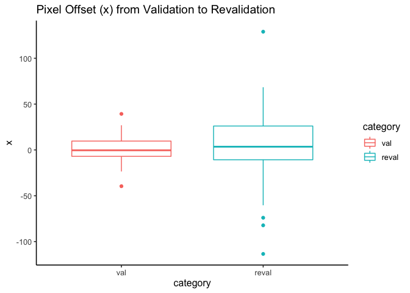<!-- -->

#### Paired samples t-test for y offset

``` r
t.test(
  x = val_reval_changes_df$pix_y_offset_val, 
  y = val_reval_changes_df$pix_y_offset_reval,
  paired = TRUE
)
```

    ## 
    ##  Paired t-test
    ## 
    ## data:  val_reval_changes_df$pix_y_offset_val and val_reval_changes_df$pix_y_offset_reval
    ## t = 0.14556, df = 48, p-value = 0.8849
    ## alternative hypothesis: true difference in means is not equal to 0
    ## 95 percent confidence interval:
    ##  -10.56464  12.21362
    ## sample estimates:
    ## mean of the differences 
    ##               0.8244898

``` r
get_offset_boxplot(df = categorized_offset_df, group = "category", measure = "y")
```

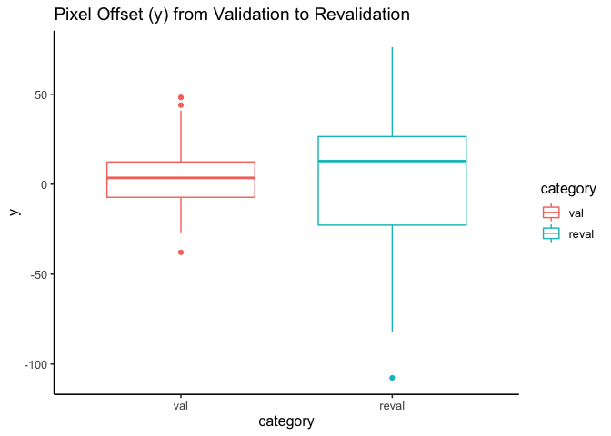<!-- -->

#### Paired samples Wilcoxon test for distance

``` r
wilcox.test(
  distance ~ category,
  data = categorized_offset_df,
  paired = TRUE
)
```

    ## 
    ##  Wilcoxon signed rank exact test
    ## 
    ## data:  distance by category
    ## V = 1141, p-value = 4.236e-09
    ## alternative hypothesis: true location shift is not equal to 0

``` r
get_offset_boxplot(df = categorized_offset_df, group = "category", measure = "distance")
```

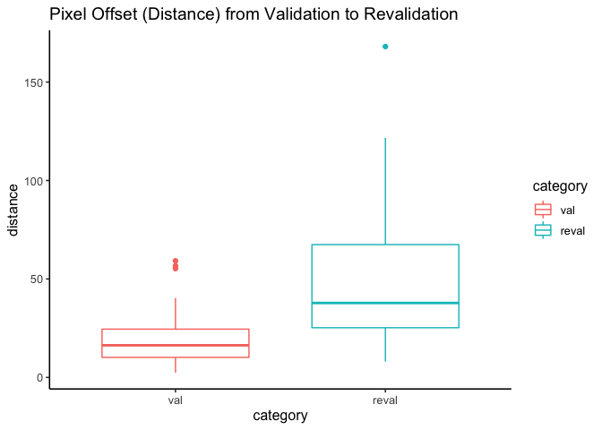<!-- -->

### Paired Plots

### Paired plots for validation-revalidation changes

Plot the change in average error with gradient coloring for the slope of
average error change.

``` r
make_paired_plot <- function(categorized_df, measure) {
  # requires a categorized dataframe, the category column selector, and measure (str)
  plt <- categorized_df %>%
    ggplot(aes(x = factor(category, level = c("val", "reval")), y = !!sym(measure), group = id)) +
    geom_point(size = 1, alpha = 0.5) +
    geom_line(alpha = 0.6, aes(color = !!sym(str_glue("{ measure }_change")))) +
    scale_color_gradient2(low = "red", mid = "gray", high = "blue")
  return (plt)
}
```

#### Offset changes

``` r
make_paired_plot(categorized_offset_df, 
  measure = "x") +
  labs(
    title = "Change in X Offset between Validation and Revalidation",
    #subtitle = "Only Decreases in Average Error",
    x = "Event Category",
    y = "X Offset (pixels)"
  ) +
  theme_classic2()
```

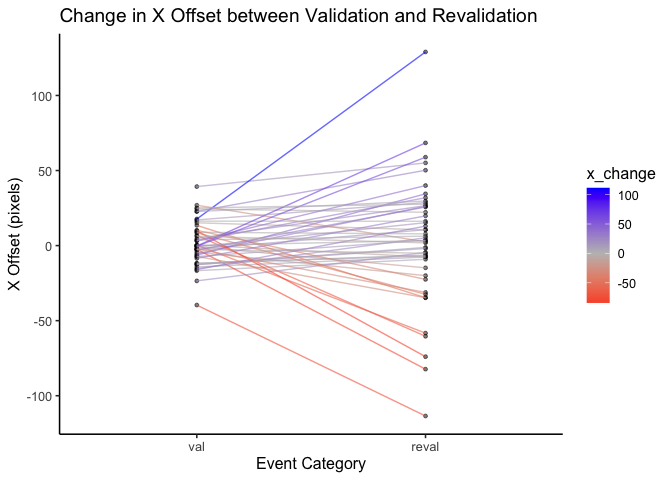<!-- -->

``` r
make_paired_plot(categorized_offset_df, 
  measure = "y") +
  labs(
    title = "Change in Y Offset between Validation and Revalidation",
    #subtitle = "Only Decreases in Average Error",
    x = "Event Category",
    y = "Y Offset (pixels)"
  ) +
  theme_classic2()
```

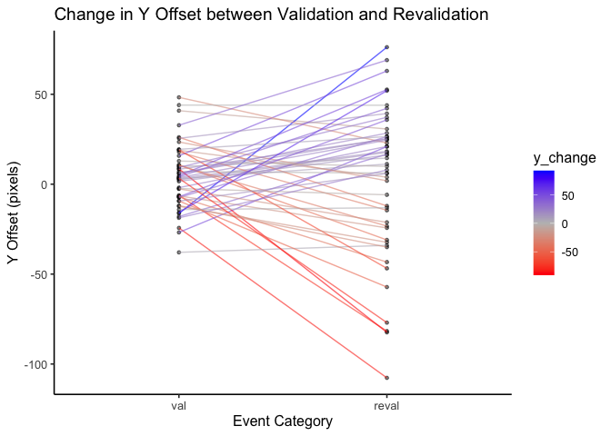<!-- -->

``` r
make_paired_plot(categorized_offset_df, 
  measure = "distance") +
  labs(
    title = "Change in Distance Offset between Validation and Revalidation",
    #subtitle = "Only Decreases in Average Error",
    x = "Event Category",
    y = "Distance Offset (pixels)"
  ) +
  theme_classic2()
```

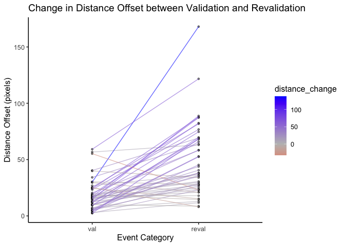<!-- -->

#### Average error changes

``` r
make_paired_plot(categorized_error_df %>% filter(avg_change < 0),
  measure = "avg") +
  labs(
    title = "Change in Avg Error between Validation and Revalidation",
    subtitle = "Only Decreases in Average Error",
    x = "Event Category",
    y = "Avg Error"
  ) +
  theme_classic2()
```

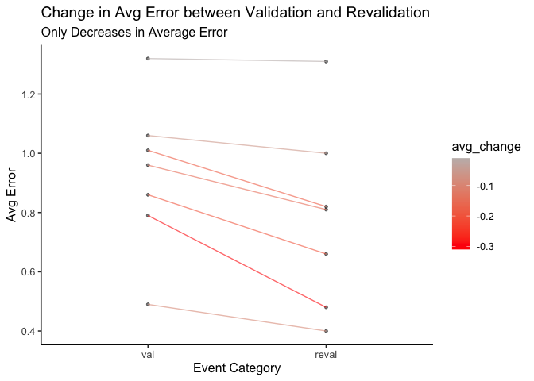<!-- -->

``` r
make_paired_plot(categorized_error_df %>% filter(avg_change > 0),
  measure = "avg") +
  labs(
    title = "Change in Avg Error between Validation and Revalidation",
    subtitle = "Only Increases in Average Error",
    x = "Event Category",
    y = "Avg Error"
  ) +
  theme_classic2()
```

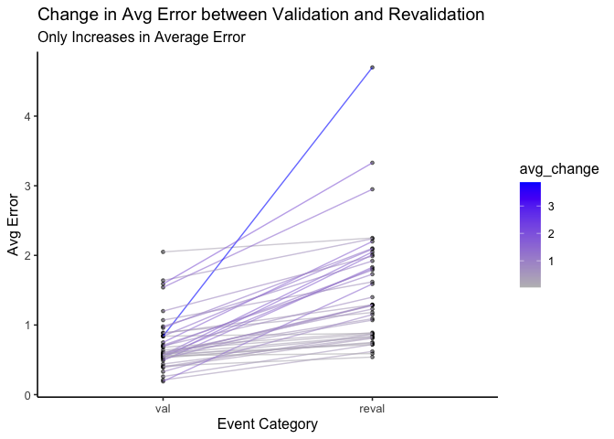<!-- -->

``` r
make_paired_plot(categorized_error_df %>% filter(id != 11),
  measure = "avg") +
  labs(
    title = "Change in Avg Error between Validation and Revalidation",
    subtitle = "Only Increases in Average Error",
    x = "Event Category",
    y = "Avg Error"
  ) +
  theme_classic2()
```

<!-- -->

## Samples data

``` r
make_pretty_df(
  head(etd_samples[[4]], 20)
)
```

|      time |            gx |            gy |
| --------: | ------------: | ------------: |
| 1,237,276 |       \-563.5 |       \-202.5 |
| 1,237,278 |       \-564.3 |       \-202.6 |
| 1,237,280 |       \-565.1 |       \-202.6 |
| 1,237,282 |       \-565.6 |       \-202.6 |
| 1,237,284 |       \-651.9 |       \-198.4 |
| 1,237,286 |       \-740.2 |       \-194.0 |
| 1,237,288 |       \-803.1 |       \-191.0 |
| 1,237,290 | 100,000,000.0 | 100,000,000.0 |
| 1,237,292 | 100,000,000.0 | 100,000,000.0 |
| 1,237,294 | 100,000,000.0 | 100,000,000.0 |
| 1,237,296 | 100,000,000.0 | 100,000,000.0 |
| 1,237,298 | 100,000,000.0 | 100,000,000.0 |
| 1,237,300 | 100,000,000.0 | 100,000,000.0 |
| 1,237,302 | 100,000,000.0 | 100,000,000.0 |
| 1,237,304 | 100,000,000.0 | 100,000,000.0 |
| 1,237,306 | 100,000,000.0 | 100,000,000.0 |
| 1,237,308 | 100,000,000.0 | 100,000,000.0 |
| 1,237,310 | 100,000,000.0 | 100,000,000.0 |
| 1,237,312 | 100,000,000.0 | 100,000,000.0 |
| 1,237,314 | 100,000,000.0 | 100,000,000.0 |

### Extract samples for task duration

``` r
FIXED_ID <- 4
MILLISECONDS_PER_HOUR <- 3600000
MILLISECONDS_PER_SECONDS <- 1000
GX_SAMPLE_ERROR_VALUE <- 10^7
GY_SAMPLE_ERROR_VALUE <- 10^7
SCREEN_WIDTH_PX <- 1280
SCREEN_HEIGHT_PX <- 1024
SCREEN_BIN_WIDTH_PX <- 16
SCREEN_CENTER_COORD <- c(SCREEN_WIDTH_PX / 2, SCREEN_HEIGHT_PX / 2)

# get the task start time from recordings data embedded in cleaned
# val_reval changes dataframe
task_start_time <- val_reval_changes_df %>%
  filter(id == FIXED_ID) %>%
  pull(task)

# Filter sample data per participant for the hour duration
# from start to end of task, then translate and transform
# frame of reference for time to start at 0 in seconds. Remove
# all error values for gaze sample and plot
task_gaze_df <- etd_samples[[FIXED_ID]] %>% 
  filter(time >= task_start_time & time < task_start_time + MILLISECONDS_PER_HOUR) %>%
  mutate(time = (time - time[[1]]) / MILLISECONDS_PER_SECONDS) %>%
  filter(gx < GX_SAMPLE_ERROR_VALUE & gy < GY_SAMPLE_ERROR_VALUE)

plt <- ggplot(task_gaze_df, aes(x = gx, y = gy)) +
  #xlim(0, SCREEN_WIDTH_PX) +
  #ylim(0, SCREEN_HEIGHT_PX) +
  theme_minimal() +
  labs(
    title = str_glue("Heatmap of gaze samples across task duration for CSN{ str_pad(FIXED_ID, 3, pad = '0') }")
  )

# add clock circle in
# flip all participants to same orientation (all left, or all right, but not both)

# Validate translations for pixel offset, point by point
# 1. clock on left
# 2. Cut data from non-clock side/half
# 3. Average distance from clock hand's tip per timestamp
# 4. Offset of x,y from val/reval is the translation, use mean of two values for each orientation
# 5. Compare distance from clock with and without correction by offset
# 6. Worth looking at quartiles of average distance per participant
# 7. Then plot average distance for each participant in a plot
# 
# See matlab task code to see where tip of clock hand is at every second
plt + geom_bin2d(binwidth = c(SCREEN_BIN_WIDTH_PX, SCREEN_BIN_WIDTH_PX))
```

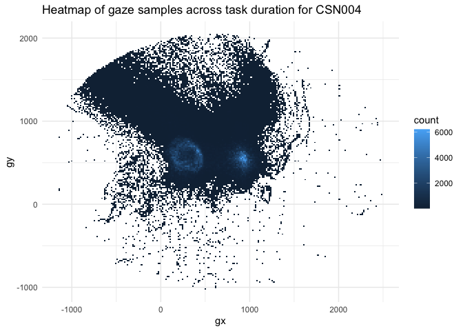<!-- -->

## Playground

Things in progress

``` r
make_pretty_df(
  val_reval_changes_df %>%
    filter(avg_error_val < 1.5 & avg_error_reval < 1.5)
)
```

| id | avg\_error\_change | max\_error\_change | pix\_x\_offset\_change | pix\_y\_offset\_change | calibration | validation |       task | revalidation | sttime\_val | quality\_val | avg\_error\_val | max\_error\_val | deg\_offset\_val | pix\_x\_offset\_val | pix\_y\_offset\_val | sttime\_reval | quality\_reval | avg\_error\_reval | max\_error\_reval | deg\_offset\_reval | pix\_x\_offset\_reval | pix\_y\_offset\_reval |
| -: | -----------------: | -----------------: | ---------------------: | ---------------------: | ----------: | ---------: | ---------: | -----------: | ----------: | :----------- | --------------: | --------------: | ---------------: | ------------------: | ------------------: | ------------: | :------------- | ----------------: | ----------------: | -----------------: | --------------------: | --------------------: |
| 21 |             \-0.01 |               1.47 |                 \-24.4 |                 \-25.4 |   1,774,038 |  1,774,103 |  2,252,886 |    5,952,349 |   2,095,959 | POOR         |            1.32 |            2.64 |             1.18 |                26.9 |                48.3 |     6,111,905 | POOR           |              1.31 |              4.11 |               0.55 |                   2.5 |                  22.9 |
| 52 |               0.03 |             \-0.82 |                    2.5 |                   15.4 |   1,304,788 |  1,304,855 |  1,521,416 |    5,176,799 |   1,467,984 | FAIR         |            0.56 |            1.60 |             0.25 |                 3.8 |               \-9.4 |     5,205,726 | GOOD           |              0.59 |              0.78 |               0.21 |                   6.3 |                   6.0 |
|  4 |               0.04 |               0.07 |                  \-4.7 |                   15.1 |   1,237,276 |  1,237,353 |  1,840,796 |    5,653,681 |   1,769,410 | GOOD         |            0.84 |            1.10 |             0.36 |                15.2 |                 3.2 |     5,689,157 | GOOD           |              0.88 |              1.17 |               0.49 |                  10.5 |                  18.3 |
| 18 |             \-0.06 |               0.75 |                  \-2.2 |                   34.7 |   1,878,264 |  1,878,319 |  2,176,006 |    5,871,247 |   2,131,274 | FAIR         |            1.06 |            1.72 |             0.76 |                24.4 |              \-18.0 |     5,898,916 | POOR           |              1.00 |              2.47 |               0.73 |                  22.2 |                  16.7 |
| 38 |             \-0.09 |             \-0.17 |                    5.6 |                    1.0 |   7,163,188 |  7,163,245 |  7,525,292 |   11,157,809 |   7,464,045 | GOOD         |            0.49 |            1.40 |             0.41 |              \-11.9 |              \-14.1 |    11,180,287 | GOOD           |              0.40 |              1.23 |               0.32 |                 \-6.3 |                \-13.1 |
| 26 |               0.14 |               0.27 |                   20.5 |                 \-17.8 |   2,270,082 |  2,270,145 |  2,675,926 |    6,324,101 |   2,597,140 | GOOD         |            0.58 |            0.97 |             0.46 |              \-15.3 |               \-6.5 |     6,362,123 | GOOD           |              0.72 |              1.24 |               0.59 |                   5.2 |                \-24.3 |
| 23 |             \-0.15 |               0.22 |                   11.5 |                    3.9 |   1,045,664 |  1,045,729 |  1,247,312 |    4,893,087 |   1,218,359 | FAIR         |            0.96 |            1.93 |             0.93 |              \-12.7 |              \-37.9 |     4,917,114 | POOR           |              0.81 |              2.15 |               0.77 |                 \-1.2 |                \-34.0 |
| 54 |             \-0.19 |               1.48 |                   29.0 |                   26.6 |     949,944 |    950,013 |  1,503,486 |    5,135,219 |   1,460,781 | FAIR         |            1.01 |            1.57 |             0.67 |              \-16.0 |              \-18.7 |     5,156,673 | POOR           |              0.82 |              3.05 |               0.39 |                  13.0 |                   7.9 |
|  9 |               0.20 |               0.29 |                   13.0 |                 \-32.4 |  12,714,578 | 12,714,637 | 12,986,604 |   16,661,443 |  12,929,488 | GOOD         |            0.54 |            1.44 |             0.40 |               \-2.4 |                17.9 |    16,683,293 | FAIR           |              0.74 |              1.73 |               0.38 |                  10.6 |                \-14.5 |
| 12 |             \-0.20 |             \-0.51 |                   10.7 |                   47.7 |   1,124,654 |  1,124,721 |  1,487,916 |    5,160,147 |   1,448,114 | GOOD         |            0.86 |            1.35 |             0.76 |              \-12.6 |              \-26.8 |     5,192,924 | GOOD           |              0.66 |              0.84 |               0.50 |                 \-1.9 |                  20.9 |
| 43 |               0.21 |               1.39 |                   28.3 |                 \-20.0 |     730,520 |    730,595 |    909,672 |    4,544,091 |     846,280 | GOOD         |            0.68 |            0.98 |             0.33 |               \-8.5 |              \-12.3 |     4,567,038 | POOR           |              0.89 |              2.37 |               0.82 |                  19.8 |                \-32.3 |
| 39 |               0.22 |               0.25 |                  \-0.1 |                   16.8 |   2,126,800 |  2,126,879 |  2,214,578 |    5,861,623 |   2,164,086 | GOOD         |            0.53 |            0.94 |             0.47 |                16.3 |                 8.3 |     6,143,466 | GOOD           |              0.75 |              1.19 |               0.71 |                  16.2 |                  25.1 |
| 25 |               0.23 |               0.19 |                    6.6 |                   33.8 |   1,249,028 |  1,249,091 |  1,570,970 |    5,250,885 |   1,471,275 | GOOD         |            0.64 |            0.99 |             0.41 |              \-14.2 |               \-7.4 |     5,292,966 | GOOD           |              0.87 |              1.18 |               0.71 |                 \-7.6 |                  26.4 |
| 49 |               0.25 |               1.49 |                   16.1 |                    7.1 |   6,982,698 |  6,982,759 |  7,209,750 |   10,834,899 |   7,168,814 | GOOD         |            0.59 |            1.22 |             0.50 |               \-0.8 |                19.4 |    10,854,898 | POOR           |              0.84 |              2.71 |               0.72 |                  15.3 |                  26.5 |
| 42 |               0.28 |               0.38 |                   10.9 |                 \-33.7 |   2,133,614 |  2,133,673 |  2,390,322 |    6,031,297 |   2,349,859 | GOOD         |            0.55 |            1.40 |             0.31 |               \-7.3 |                10.4 |     6,057,399 | FAIR           |              0.83 |              1.78 |               0.57 |                   3.6 |                \-23.3 |
|  8 |               0.29 |               2.34 |                   28.7 |                    4.7 |   2,236,502 |  2,236,561 |  2,722,916 |    6,407,267 |   2,661,415 | FAIR         |            0.89 |            1.59 |             0.26 |                 3.2 |                 9.8 |     6,428,591 | POOR           |              1.18 |              3.93 |               1.02 |                  31.9 |                  14.5 |
| 34 |             \-0.31 |               0.29 |                  \-1.1 |                 \-21.6 |     730,156 |    730,235 |  1,761,032 |    5,407,309 |   1,660,381 | GOOD         |            0.79 |            1.10 |             0.58 |                 8.9 |                23.5 |     5,425,374 | GOOD           |              0.48 |              1.39 |               0.18 |                   7.8 |                   1.9 |
|  5 |               0.38 |             \-0.08 |                 \-15.6 |                   22.9 |   2,173,786 |  2,173,859 |  2,554,346 |    6,199,151 |   2,499,059 | GOOD         |            0.44 |            1.11 |             0.11 |               \-4.4 |               \-1.9 |     6,269,103 | GOOD           |              0.82 |              1.03 |               0.64 |                \-20.0 |                  21.0 |
|  6 |               0.41 |               0.56 |                 \-14.1 |                   15.3 |   7,524,796 |  7,524,855 |  7,935,316 |   11,670,985 |   7,870,548 | GOOD         |            0.21 |            0.42 |             0.06 |               \-0.7 |                 2.4 |    11,702,118 | GOOD           |              0.62 |              0.98 |               0.57 |                \-14.8 |                  17.7 |
| 16 |               0.41 |               8.53 |                   40.9 |                 \-38.2 |   8,007,176 |  8,007,241 |  8,290,424 |   11,953,749 |   8,255,843 | GOOD         |            0.88 |            1.18 |             0.74 |               \-6.4 |                26.1 |    11,979,423 | POOR           |              1.29 |              9.71 |               1.15 |                  34.5 |                \-12.1 |
| 30 |               0.42 |               0.00 |                    3.3 |                    8.2 |   2,338,996 |  2,339,053 |  2,432,284 |    6,112,299 |   2,381,860 | GOOD         |            0.39 |            0.92 |             0.07 |                 0.1 |                 3.0 |     6,135,741 | GOOD           |              0.81 |              0.92 |               0.26 |                   3.4 |                  11.2 |
|  7 |               0.46 |               0.90 |                  \-8.0 |                   19.2 |   1,665,884 |  1,665,951 |  2,051,128 |    5,764,131 |   1,975,331 | GOOD         |            0.26 |            0.43 |             0.15 |                 0.4 |                 6.1 |     5,793,871 | GOOD           |              0.72 |              1.33 |               0.64 |                 \-7.6 |                  25.3 |
| 19 |               0.47 |               0.23 |                   31.6 |                 \-41.8 |   1,512,960 |  1,513,023 |  1,838,636 |    5,466,945 |   1,782,491 | GOOD         |            0.40 |            1.00 |             0.27 |               \-5.4 |                10.8 |     5,517,377 | GOOD           |              0.87 |              1.23 |               0.79 |                  26.2 |                \-31.0 |
| 44 |               0.48 |               0.77 |                   28.7 |                   22.3 |   2,754,202 |  2,754,261 |  3,025,672 |    6,670,383 |   2,967,643 | FAIR         |            0.61 |            1.65 |             0.17 |               \-3.0 |                 6.1 |     6,724,748 | POOR           |              1.09 |              2.42 |               0.86 |                  25.7 |                  28.4 |
| 51 |               0.50 |               0.49 |                   11.6 |                   20.8 |     963,978 |    964,039 |  1,162,098 |    4,793,365 |   1,091,056 | GOOD         |            0.57 |            0.79 |             0.44 |                17.1 |                 3.7 |     4,813,281 | FAIR           |              1.07 |              1.28 |               0.93 |                  28.7 |                  24.5 |
| 41 |               0.63 |               0.73 |                 \-32.7 |                   14.6 |   7,257,234 |  7,257,297 |  7,647,212 |   11,363,419 |   7,490,599 | FAIR         |            0.60 |            1.55 |             0.23 |                10.2 |                 1.6 |    11,476,259 | POOR           |              1.23 |              2.28 |               0.70 |                \-22.5 |                  16.2 |
| 47 |               0.70 |               2.30 |                   21.9 |                   67.7 |     144,138 |    144,205 |    355,892 |    4,111,473 |     315,401 | GOOD         |            0.70 |            1.36 |             0.35 |                 4.7 |              \-15.7 |     4,132,569 | POOR           |              1.40 |              3.66 |               1.19 |                  26.6 |                  52.0 |
| 32 |               0.71 |               0.95 |                    4.8 |                 \-36.3 |   2,246,952 |  2,247,023 |  2,450,194 |    6,189,683 |   2,361,135 | GOOD         |            0.57 |            1.19 |             0.36 |              \-11.7 |               \-7.0 |     6,270,702 | POOR           |              1.28 |              2.14 |               1.05 |                 \-6.9 |                \-43.3 |
| 48 |               0.72 |               0.45 |                   36.8 |                 \-18.6 |     591,876 |    591,941 |  1,039,962 |    4,672,597 |     994,193 | GOOD         |            0.57 |            1.16 |             0.10 |                 3.2 |               \-2.6 |     4,691,363 | FAIR           |              1.29 |              1.61 |               1.13 |                  40.0 |                \-21.2 |
| 57 |               0.78 |               1.40 |                 \-29.0 |                   38.1 |   6,965,480 |  6,965,545 |  7,173,636 |   11,013,773 |   7,114,193 | GOOD         |            0.51 |            1.25 |             0.11 |               \-2.2 |                 4.1 |    11,031,374 | POOR           |              1.29 |              2.65 |               1.18 |                \-31.2 |                  42.2 |
| 56 |               0.82 |               0.15 |                  \-4.5 |                   42.8 |     905,592 |    905,671 |  1,072,892 |    4,729,717 |   1,023,642 | FAIR         |            0.33 |            1.57 |             0.22 |                 6.3 |               \-7.0 |     4,788,218 | FAIR           |              1.15 |              1.72 |               0.88 |                   1.8 |                  35.8 |

``` r
df <- val_reval_changes_df %>%
    filter(avg_error_val < 2.5 & avg_error_reval < 2.5)

t.test(df$avg_error_change, mu = 0)
```

    ## 
    ##  One Sample t-test
    ## 
    ## data:  df$avg_error_change
    ## t = 7.319, df = 45, p-value = 3.437e-09
    ## alternative hypothesis: true mean is not equal to 0
    ## 95 percent confidence interval:
    ##  0.3901369 0.6863848
    ## sample estimates:
    ## mean of x 
    ## 0.5382609
